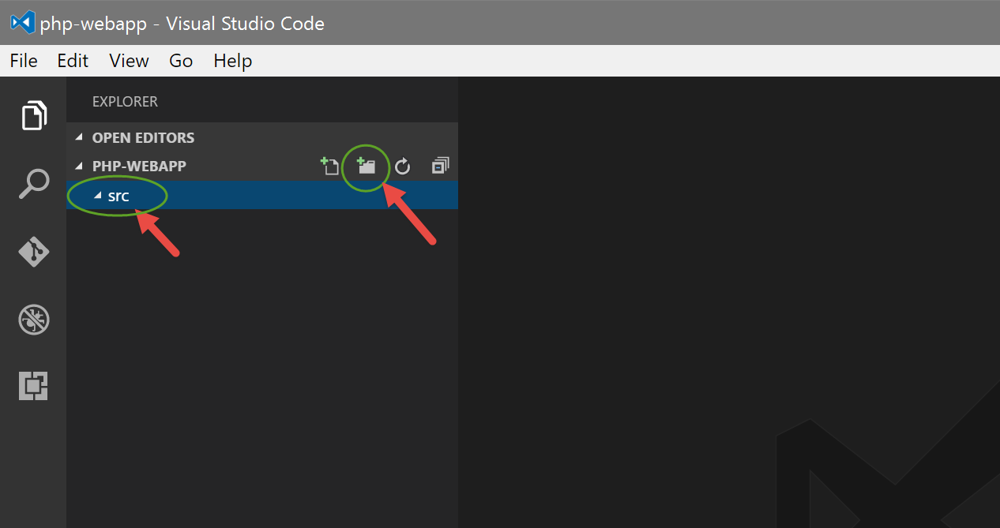
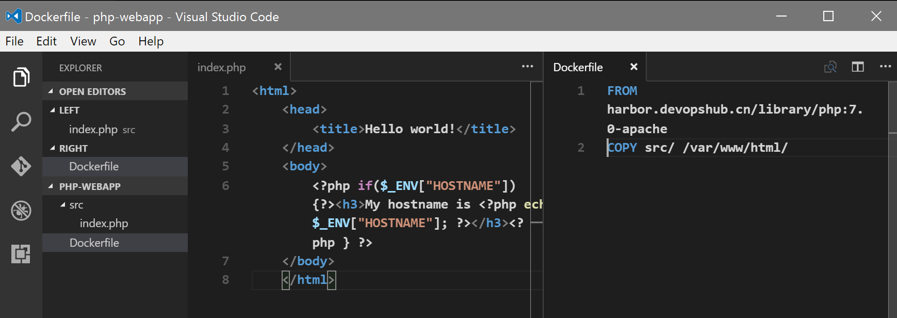
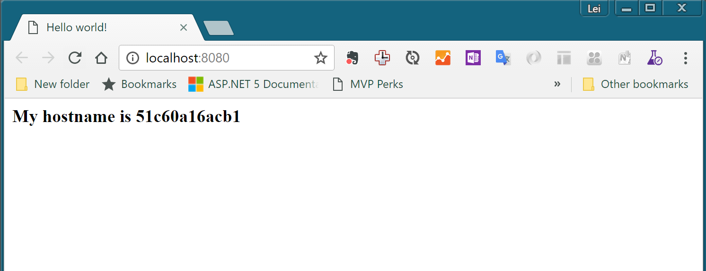

练习二：使用docker build来构建容器镜像并运行
~~~~~~~~~~~~~~~~~~~~~~~~~~~~~~~~~~~~~~~~~~

实验准备

请使用以下命令清理本地docker环境，确保后续实验的正确运行

.. code-block:: shell

    FOR /f "tokens=*" %i IN ('docker ps -a -q') DO docker stop %i
    FOR /f "tokens=*" %i IN ('docker ps -a -q') DO docker rm %i

准备容器开发环境
^^^^^^^^^^^^^^^^^^^^^^^^

在磁盘上建立docker-training目录，并在其中创建php-webapp目录，然后输入code .启动 Visual Studio Code 并打开php-webapp作为工作目录

.. code-block:: shell

    λ mkdir docker-training
    λ cd docker-training\
    λ mkdir php-webapp
    λ cd php-webapp\
    λ code .

在 Visual Studio Code 中点击新建文件夹按钮，创建src目录用来存放源代码

创建项目代码
^^^^^^^^^^^^^^^^^^^^^^^^

分别创建以下文件

请注意文件的位置，一个在src目录中，另外一个在根目录

- src/index.php

.. code-block:: html

    <html>
    <head>
        <title>Hello world!</title>
    </head>
    <body>
        <?php if($_ENV["HOSTNAME"]) {?><h3>My hostname is <?php echo $_ENV["HOSTNAME"]; ?></h3><?php } ?>
    </body>
    </html>

- Dockerfile

.. code-block:: shell

    FROM harbor.devopshub.cn/library/php:7.0-apache 
    COPY src/ /var/www/html/

构建容器镜像
^^^^^^^^^^^^^^^^^^^^^^^^

进入/docker-training/php-webapp目录，并执行命令完成容器镜像的构建

.. code-block:: shell

    D:\docker-training\php-webapp
    λ docker build -t php-webapp:1 .

执行结果如下，你可以看到这个命令执行了3部分内容

1. 将我们应用程序的内容上传至docker daemon
2. 从我们的私有镜像仓库拉取了Dockerfile里面所定义的基础镜像(FROM)
3. 按照Dockerfile里面所定义的步骤完成打包操作

.. code-block:: shell

    Sending build context to Docker daemon 3.584 kB
    Step 1/2 : FROM harbor.devopshub.cn/library/php:7.0-apache
    7.0-apache: Pulling from library/php
    386a066cd84a: Already exists
    269e95c6053a: Already exists
    6243d5c57a34: Already exists
    872f6d38a33b: Already exists
    e5ea5361568c: Already exists
    f81f18e77719: Already exists
    f9dbc878ca0c: Already exists
    195935e4100b: Already exists
    935d0c2409b2: Pull complete
    d14786710093: Pull complete
    b7dff268d83a: Pull complete
    d1083150956d: Pull complete
    9284aa2927a6: Pull complete
    Digest: sha256:05fe69944d513bd618ad81cf6160e2f0e8237a3abf8383c816b8bbbc5ff83418
    Status: Downloaded newer image for harbor.devopshub.cn/library/php:7.0-apache
    ---> 336e2be8a343
    Step 2/2 : COPY src/ /var/www/html/
    ---> 0996039f9f99
    Removing intermediate container f5f368e823a1
    Successfully built 0996039f9f99

完成后，使用docker images {镜像名称} 命令来查看构建好的容器镜像

.. code-block:: shell

    λ docker images php-webapp
    REPOSITORY          TAG                 IMAGE ID            CREATED                  SIZE
    php-webapp          1                   0996039f9f99        Less than a second ago   403 MB

运行我们的容器镜像
^^^^^^^^^^^^^^^^^^^^^^^^

完成以上容器镜像构建后，我们就可以使用docker run来运行我们的应用了

.. code-block:: shell

    λ docker run -itd -p 8080:80 php-webapp:1
    51c60a16acb1fa17655470cf6304803f738f6f576e7e3d250fba865c0ff5be72

运行以上命令后打开浏览器并导航至 http://localhost:8080 ，你将看到刚才我们所编写的index.php的内容

修改代码并重新打包并运行
^^^^^^^^^^^^^^^^^^^^^^^^

完成以上步骤后，你就可以按照日常开发的流程，修改代码，构建容器，运行容器来完成应用的开发和调试工作了。请注意在每次构建容器镜像的时候将标签号码增加或者设置为自己认为合适的值，这样便于你管理自己的容器镜像。重复几次构建后，再使用docker images php-webapp命令的效果应该类似如下输出。

.. code-block:: shell

    λ docker images php-webapp
    REPOSITORY          TAG                 IMAGE ID            CREATED                  SIZE
    php-webapp          1                   0996039f9f99        Less than a second ago   403 MB
    php-webapp          2                   0996039f9f99        Less than a second ago   403 MB
    php-webapp          3                   0996039f9f99        Less than a second ago   403 MB

小结
^^^^^^^^^^^^^^^^^^^^^^^^

至此，我们就完成了一个简单的php web应用的容器化打包和运行过程。如果你本地没有安装php环境，你就会注意到使用容器进行应用开发，打包和运行的好处。我们不需要再根据自己所开发的应用来繁琐重复的配置自己的开发、测试和运行环境，所有的应用依赖都可以运行在容器中。这样做我们既简化了开发环境的配置，也防止了应为华宁不一致而造成的很多问题。

在下一节中，我们将使用docker-machine命令来管理容器化主机，容器化主机是容器运行的环境，通过docker-machine我们就可以统一管理这些主机，让我们可以将自己构建好的容器镜像发送到不同的主机上去运行。

