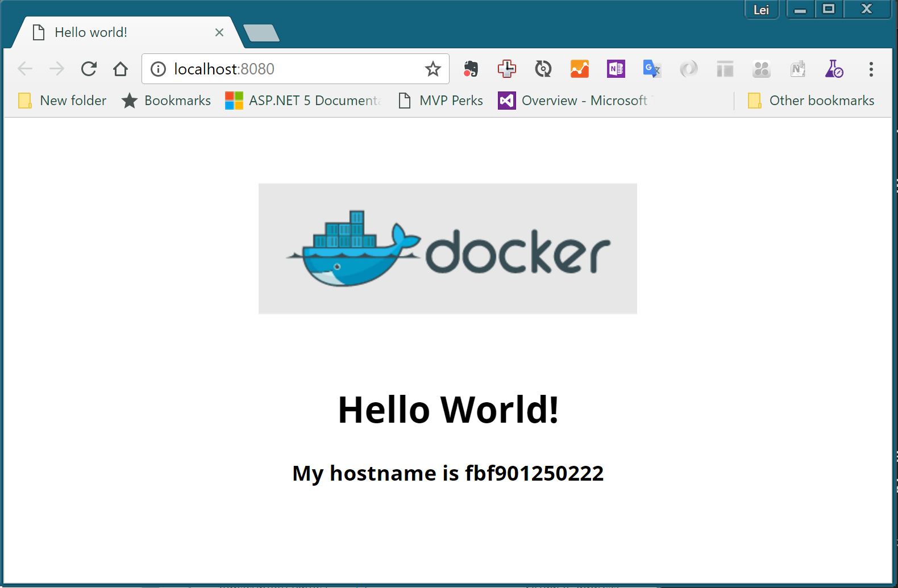

练习一：使用docker基本命令
~~~~~~~~~~~~~~~~~~~~~~

实验准备

运行pullimage.cmd来拉取ubuntu和php-sample这2个容器镜像。

使用容器运行Hello World
^^^^^^^^^^^^^^^^^^^^^^^^

使用命令行运行以下命令，此命令将启动一个ubuntu的容器并在其中输出 Hello World文本，执行完毕后，容器自动退出。

.. code-block:: shell

    $ docker run ubuntu /bin/echo 'Hello world'
    Hello world

与容器进行交互
^^^^^^^^^^^^^^^^^^^^^^^^

使用命令行运行以下命令，此命令将启动一个ubuntu容器并在其中运行bash交互命令行界面，你可以尝试运行pwd，ls，ps等命令查看容器内环境，就如同远程操作一台服务器一样。

.. code-block:: shell

    $ docker run -t -i ubuntu /bin/bash
    root@af8bae53bdd3:/#

在容器中运行持续任务并管理容器生命周期
^^^^^^^^^^^^^^^^^^^^^^^^

使用命令行运行以下命令，此命令将启动一个ubuntu容器并在其中持续运行echo hello world，启动后容器会持续输出hello world文本。

.. code-block:: shell

    $ docker run -d ubuntu /bin/sh -c "while true; do echo hello world; sleep 1; done"
    1e5535038e285177d5214659a068137486f96ee5c2e85a4ac52dc83f2ebe4147

注意当你运行以上命令后，命令行直接退出并没有持续输出hello world文本，这是因为我们使用了-d参数，这时容器在后台运行，你可以通过docker logs命令获取容器内的日志输出，注意替换c3a2为你的容器ID的前四位，如下：

.. code-block:: shell

    $ docker logs -f c3a2
    hello world
    hello world
    hello world
    hello world
    hello world
    hello world
    ... 

为了查看当前正在运行状态的容器，你可以使用docker ps命令，如下：

.. code-block:: shell

    $ docker ps
    CONTAINER ID        IMAGE               COMMAND                  CREATED                  STATUS              PORTS               NAMES
    c3a251374851        ubuntu              "/bin/sh -c 'while..."   Less than a second ago   Up 2 minutes                            evil_ride

你也可以查看到那些没有在运行状态的容器，使用docker ps -a命令，如下：

.. code-block:: shell

    $ docker ps -a
    CONTAINER ID        IMAGE               COMMAND                  CREATED                  STATUS                     PORTS               NAMES
    c3a251374851        ubuntu              "/bin/sh -c 'while..."   Less than a second ago   Up 6 minutes                                   evil_ride
    b6d4324edfbc        ubuntu              "/bin/bash"              Less than a second ago   Exited (0) 6 minutes ago                       small_beaver
    3363b0a14324        ubuntu              "/bin/echo 'Hello ..."   Less than a second ago   Exited (0) 7 minutes ago                       hungry_stonebraker

注意以上出了第一个容器正在运行意外，另外2个ubuntu容器都已经停止，但是容器仍然存在。你可以理解为他们是没有被运行中的应用，而应用的文件存在于你的docker环境中。

现在，你可以通过docker stop {id}命令来停止正在运行的容器，如下：

.. code-block:: shell

    λ docker stop c3a2
    c3a2

然后，通过docker rm {id}命令来删除所有未运行的容器，(注意将id替换成你自己的容器ID的前四位)如下：

.. code-block:: shell

    λ docker rm c3a2 b6d4 3363
    c3a2
    b6d4
    3363

也可以通过这个命令自动枚举所有容器并停止，删除：

.. code-block:: shell

    FOR /f "tokens=*" %i IN ('docker ps -a -q') DO docker stop %i
    FOR /f "tokens=*" %i IN ('docker ps -a -q') DO docker rm %i

运行web应用并通过浏览器访问
^^^^^^^^^^^^^^^^^^^^^^^^

使用命令行运行以下命令

.. code-block:: shell

    $ docker run -itd -p 8080:80 training/php-sample:5
    fbf9012502229877066ad5e63a1be5727055243857927a1d36ede432d7c3cc20

完成后打开浏览器并导航到 http://localhost:8080，你应该可以看到类似以下页面

注意以上命令与之前的最大区别在于使用了-p参数来映射网络端口，这样我们就可以通过容器主机的8080端口来访问容器的80端口，类似于实现了一个简单的NAT。你也可以使用-P(大写)参数来让docker自动分配主机端口，这样可以避免我们手动分配端口造成冲突。

你可以尝试使用以上实验中的docker logs和docker ps等命令查看此正在运行容器的状态和其中的web服务器所输出的日志，如下

.. code-block:: shell

    λ docker ps
    CONTAINER ID        IMAGE                   COMMAND                CREATED                  STATUS              PORTS                  NAMES
    dda5078bd856        training/php-sample:5   "apache2-foreground"   Less than a second ago   Up 2 seconds        0.0.0.0:8080->80/tcp   high_albattani

运行以下命令式请注意替换dda5为你自己的容器id，同时可以尝试刷新浏览器看到日志的实时输出

.. code-block:: shell

    λ docker logs -f dda5
    [Sun Dec 11 12:40:12.681308 2016] [mpm_prefork:notice] [pid 1] AH00163: Apache/2.4.10 (Debian) PHP/7.0.13 configured -- resuming normal operations
    [Sun Dec 11 12:40:12.681454 2016] [core:notice] [pid 1] AH00094: Command line: 'apache2 -D FOREGROUND'
    172.17.0.1 - - [11/Dec/2016:12:40:31 +0000] "GET / HTTP/1.1" 200 629 "-" "Mozilla/5.0 (Windows NT 10.0; Win64; x64) AppleWebKit/537.36 (KHTML, like Gecko) Chrome/54.0.2840.99 Safari/537.36"
    172.17.0.1 - - [11/Dec/2016:12:40:38 +0000] "GET / HTTP/1.1" 200 629 "-" "Mozilla/5.0 (Windows NT 10.0; Win64; x64) AppleWebKit/537.36 (KHTML, like Gecko) Chrome/54.0.2840.99 Safari/537.36"

另外，你还可以使用docker top {id}命令查看容器中的进程列表

.. code-block:: shell

    λ docker top dda5
    PID                 USER                TIME                COMMAND
    4241                root                0:00                apache2 -DFOREGROUND
    4262                xfs                 0:00                apache2 -DFOREGROUND
    4263                xfs                 0:00                apache2 -DFOREGROUND
    4264                xfs                 0:00                apache2 -DFOREGROUND
    4265                xfs                 0:00                apache2 -DFOREGROUND
    4266                xfs                 0:00                apache2 -DFOREGROUND
    4300                xfs                 0:00                apache2 -DFOREGROUND
    4302                xfs                 0:00                apache2 -DFOREGROUND

或者通过 docker exec 命令直接进入容器进行操作

.. code-block:: shell

    λ docker exec -it dda5 bash
    root@dda5078bd856:/var/www/html# pwd
    /var/www/html
    root@dda5078bd856:/var/www/html# ls -la
    total 24
    drwxr-xr-x 1 www-data www-data 4096 Dec  5 21:04 .
    drwxr-xr-x 1 root     root     4096 Nov  8 23:22 ..
    -rwxr-xr-x 1 root     root      573 Dec  6 03:19 index.php
    -rwxr-xr-x 1 root     root     6452 Dec  6 03:04 small_h.png
    -rwxr-xr-x 1 root     root       21 Dec  6 02:56 test.php

小结
^^^^^^^^^^^^^^^^^^^^^^^^

至此，你应该已经基本掌握了运行容器的主要命令，下一节中，我们将尝试完成一个新的容器镜像的构建并运行我们自己构建的容器镜像。

