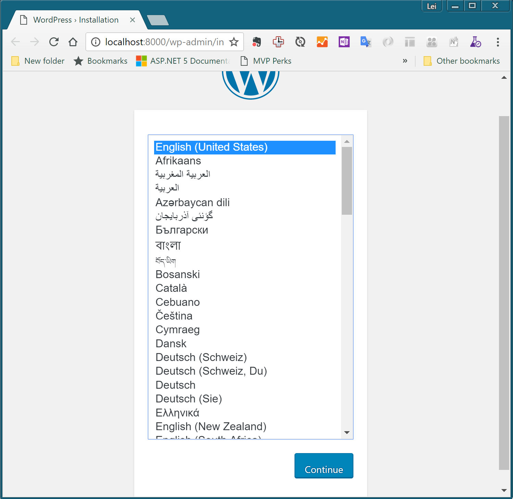

练习四：使用docker-compose命令
~~~~~~~~~~~~~~~~~~~~~~~~~~~~~~~~~~

前面的实验中，我们虽然可以使用docker run命令来灵活的管理容器运行配置，但是我们必须每次都输入繁琐的命令。在真正的容器化开发运维环境中，我们需要一种方法可以将这些配置使用文件固化下来，以便简化操作避免在重复操作中出现失误。

docker-compose就是这样一个工具，我们可以通过一个配置文件完成一个复杂应用(可能涉及多个容器)的配置，并使用同一的命令来启动这个预先配置好的部署。

01. 准备开发环境
^^^^^^^^^^^^^^^^^^^^^^^^

在之前创建的docker-training目录中创建一个叫做wordpress的子目录，并使用code .打开这个目录作为工作目录。

.. code-block:: shell

    D:\docker-training
    λ mkdir wordpress
    λ cd wordpress\
    λ code .

02. 创建docker-compose.yml文件
^^^^^^^^^^^^^^^^^^^^^^^^

使用Visual Studio Code在wordpress目录中创建docker-compose.yml文件，并将以下内容复制进去保存。

.. code-block:: shell

    version: '2'
    services:
    db:
        image: harbor.devopshub.cn/library/mysql:5.7
        environment:
          MYSQL_ROOT_PASSWORD: wordpress
          MYSQL_DATABASE: wordpress
          MYSQL_USER: wordpress
          MYSQL_PASSWORD: wordpress

    wordpress:
        depends_on:
        - db
        image: harbor.devopshub.cn/library/wordpress:latest
        links:
        - db
        ports:
        - "8000:80"
        environment:
          WORDPRESS_DB_HOST: db:3306
          WORDPRESS_DB_PASSWORD: wordpress

03. 启动部署
^^^^^^^^^^^^^^^^^^^^^^^^

配置文件编写完成后，我们在同一目录下就可以执行docker-compose up命令来启动这个部署了

.. code-block:: shell

    λ docker-compose up -d
    Starting wordpress_db_1
    Starting wordpress_wordpress_1

注意以上我加入了-d参数，这和docker run中的-d参数是一样的会让容器进行后台运行。

这个部署中我们共启动了2个容器，分别为wordpress和mysql数据库，同时将这两个容器链接到一起形成一个网络。部署完成后，我们可以打开浏览器并那导航到http://localhost:8000 看到WordPress的初始化页面，你可以尝试初始化这个WordPress站点。

这个docker-compose配置文件中的内容如果使用docker run命令也可以完成，但是就必须依靠脚本来进行管理，不利于进行版本控制和编辑。相应的docker run命令如下

.. code-block:: shell

    λ docker run -itd -e MYSQL_ROOT_PASSWORD=wordpress -e MYSQL_DATABASE=wordpress -e MYSQL_USER=wordpress -e MYSQL_PASSWORD=wordpress --name db harbor.devopshub.cn/library/mysql:5.7
    λ docker run -itd --link db:mysql -p 8000:80 -e WORDPRESS_DB_PASSWORD=wordpress harbor.devopshub.cn/library/wordpress:latest

04. 其他docker-compose命令
^^^^^^^^^^^^^^^^^^^^^^^^

docker-compose也提供了其他一些命令帮助你管理容器的生命周期，如：

docker-comopse start 
    启动当前部署

docker-compose stop 
    停止当前部署

docker-compose down 
    删除当前部署

docker-compose ps
    获取当前部署的运行情况

小结
^^^^^^^^^^^^^^^^^^^^^^^^

至此，我们了解了一种更加便捷高效的容器部署方法docker-compose。容器化开发运维的优势也越发显现出来，你可以看到，使用docker-compose我们可以将非常复杂的应用部署使用一个文件进行描述，对此配置文件进行版本控制，并使用简单的docker-compose up完成部署动作。这使得应用打包部署变得非常简单而且标准化，让我们后续构建DevOps交付管道的操作变得更加便捷。

