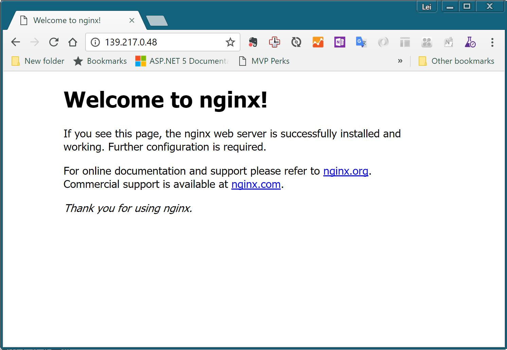
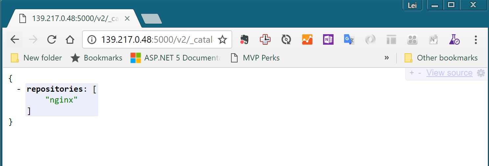
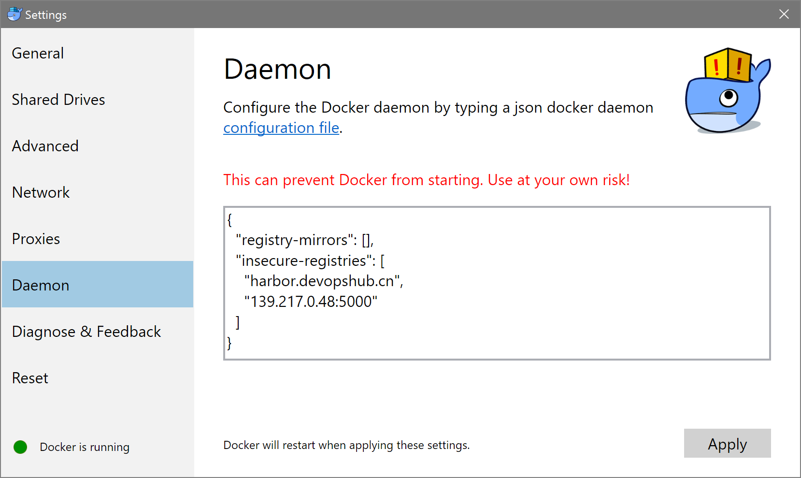
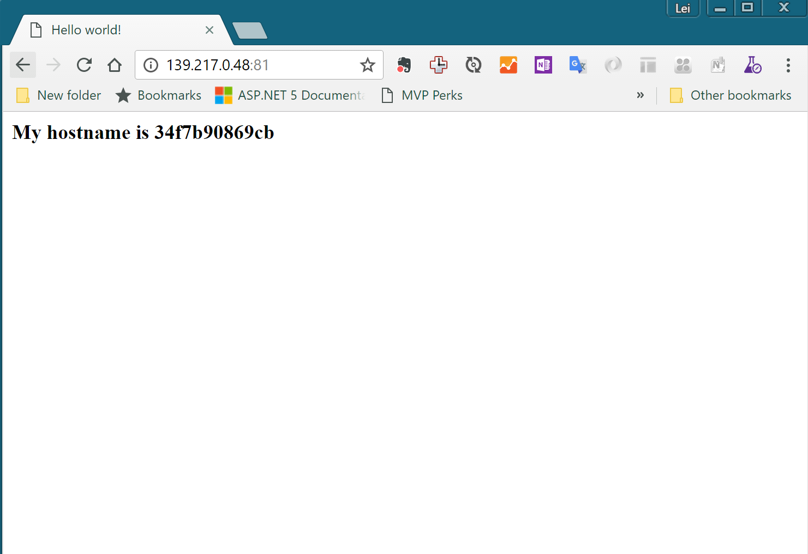

练习六：端到端的docker开发，测试运维场景
~~~~~~~~~~~~~~~~~~~~~~~~~~~~~~~~~~

在前面的练习中我们已经学习了如何使用基本的docker命令来管理容器的运行，打包和镜像拉取推送操作。在这个实验中，我们将把这些步骤串接起来形成完成的容器化开发，测试和运维场景。

01. 将远端的主机连接到本地docker-machine工具上
^^^^^^^^^^^^^^^^^^^^^^^^

虽然docker-machine提供了非常方便的创建云端容器化主机的功能，但是在日常的开发中，我们往往会先有一台Linux主机存在，然后我们希望在上面安装docker引擎。在这个场景下，docker-machine所提供的通用驱动就非常有用了。

下面的命令就可以帮助你将一台已经在数据中心或者云端运行的主机连接到本地docker-machine工具上。

.. code-block:: shell

    docker-machine create --driver generic --generic-ip-address={主机ip地址} --generic-ssh-key "{ssh连接私钥文件}" --generic-ssh-user {管理员用户名} --engine-install-url "https://get.daocloud.io/docker" {docker-machine 名称}

运行以上命令你需要具备以下条件：

- 主机可以通过ssh key的方式密码登录
- 主机管理员用户可以通过面密码的方式执行sudo
- 可以从本地访问的主机ip地址
- 主机防火墙开放了2376端口

以上所涉及的参数请从培训讲师处获取。

以下为正常的输出结果

.. code-block:: shell

    D:\docker-training\docker-machine-keys\demo
    λ docker-machine create --driver generic --generic-ip-address=139.217.0.48 --generic-ssh-key "./id_rsa" --generic-ssh-user azureuser --engine-install-url "http s://get.daocloud.io/docker" docker-training-demo
    Running pre-create checks...
    Creating machine...
    (docker-training-demo) Importing SSH key...
    Waiting for machine to be running, this may take a few minutes...
    Detecting operating system of created instance...
    Waiting for SSH to be available...
    Detecting the provisioner...
    Provisioning with ubuntu(systemd)...
    Installing Docker...
    Copying certs to the local machine directory...
    Copying certs to the remote machine...
    Setting Docker configuration on the remote daemon...
    Checking connection to Docker...
    Docker is up and running!
    To see how to connect your Docker Client to the Docker Engine running on this virtual machine, run: docker-machine env docker-training-demo

02. 配置docker-machine使用私有容器仓库
^^^^^^^^^^^^^^^^^^^^^^^^

docker默认要求使用https来连接镜像仓库，使用https需要我们配置证书。在一般的开发环境中，这不是必须的，所以我们可以通过以下配置来允许docker使用http来连接私有仓库。

.. code-block:: shell

    #使用docker-machine连接主机
    docker-machine ssh {主机名称}

    #编辑/etc/docker/daemon.json并添加私有仓库地址
    sudo vi /etc/docker/daemon.json 

在vi中按i输入以下内容
    { "insecure-registries":["harbor.devopshub.cn","localhost:5000"] }
    按ESC退出编辑
    按:wq存盘退出

.. code-block:: shell

    #从新启动docker daemon
    sudo service docker restart 

完成以上操作后，测试一下命令，如果可以成功拉取镜像则表示操作成功

.. code-block:: shell

    #从harbor.devopshub.cn上拉取nginx镜像
    sudo docker pull harbor.devopshub.cn/library/nginx

    #正常的输出如下
    azureuser@docker-training-demo:~$ sudo docker pull harbor.devopshub.cn/library/nginx
    Using default tag: latest
    latest: Pulling from library/nginx

    386a066cd84a: Pull complete
    386dc9762af9: Pull complete
    d685e39ac8a4: Pull complete
    Digest: sha256:3861a20a81e4ba699859fe0724dc6afb2ce82d21cd1ddc27fff6ec76e4c2824e
    Status: Downloaded newer image for harbor.devopshub.cn/library/nginx:latest

03. 使用docker-machine远程操作主机
^^^^^^^^^^^^^^^^^^^^^^^^

使用docker-machine env命令，我们可以将本地的docker工具链接到远程主机上，按照以下方式操作，以下操作将docker-machine env输出的最后一行命令执行后，本地的docker工具就已经连接到了远程的主机上。后续的操作都是针对远程主机执行。

.. code-block:: shell

    λ docker-machine env docker-training-demo
    SET DOCKER_TLS_VERIFY=1
    SET DOCKER_HOST=tcp://139.217.0.48:2376
    SET DOCKER_CERT_PATH=C:\Users\leixu\.docker\machine\machines\docker-training-demo
    SET DOCKER_MACHINE_NAME=docker-training-demo
    SET DOCKER_API_VERSION=1.24
    SET COMPOSE_CONVERT_WINDOWS_PATHS=true
    REM Run this command to configure your shell:
    REM     @FOR /f "tokens=*" %i IN ('docker-machine env docker-training-demo') DO @%i

    D:\docker-training\docker-machine-keys\demo
    λ @FOR /f "tokens=*" %i IN ('docker-machine env docker-training-demo') DO @%i

    D:\docker-training\docker-machine-keys\demo
    λ docker run -itd -p 80:80 harbor.devopshub.cn/library/nginx
    c369822797c6da3b315587805702ff1157495f0e67c778592565f4f4c3837b10

    D:\docker-training\docker-machine-keys\demo
    λ docker ps
    CONTAINER ID        IMAGE                               COMMAND                  CREATED              STATUS              PORTS                         NAMES
    c369822797c6        harbor.devopshub.cn/library/nginx   "nginx -g 'daemon ..."   About a minute ago   Up About a minute   0.0.0.0:80->80/tcp, 443/tcp   elated_pasteur

以上命令执行完成后，用浏览器导航到主机ip地址，可以看到nginx的默认页面如下。

04. 在远程主机上部署docker registry
^^^^^^^^^^^^^^^^^^^^^^^^

使用以下命令在远程主机上部署你自己的私有镜像仓库

.. code-block:: shell

    D:\docker-training\docker-machine-keys\demo
    λ docker run -itd -p 5000:5000 harbor.devopshub.cn/library/registry
    Unable to find image 'harbor.devopshub.cn/library/registry:latest' locally
    latest: Pulling from library/registry
    3690ec4760f9: Pull complete
    930045f1e8fb: Pull complete
    feeaa90cbdbc: Pull complete
    61f85310d350: Pull complete
    b6082c239858: Pull complete
    Digest: sha256:1152291c7f93a4ea2ddc95e46d142c31e743b6dd70e194af9e6ebe530f782c17
    Status: Downloaded newer image for harbor.devopshub.cn/library/registry:latest
    95488ebcbeba3b2cce47d946aa1fe87499fa82c51a02b26e13db92b8fcf7125b

    D:\docker-training\docker-machine-keys\demo
    λ docker ps
    CONTAINER ID        IMAGE                                  COMMAND                  CREATED             STATUS              PORTS                         NAMES 95488ebcbeba        harbor.devopshub.cn/library/registry   "/entrypoint.sh /e..."   6 seconds ago       Up 3 seconds        0.0.0.0:5000->5000/tcp        agitated_galileo
    c369822797c6        harbor.devopshub.cn/library/nginx      "nginx -g 'daemon ..."   8 minutes ago       Up 8 minutes        0.0.0.0:80->80/tcp, 443/tcp   elated_pasteur

使用以下命令讲nginx镜像推送到你自己的私有镜像仓库

.. code-block:: shell

    D:\docker-training\docker-machine-keys\demo
    λ docker tag harbor.devopshub.cn/library/nginx localhost:5000/nginx

    D:\docker-training\docker-machine-keys\demo
    λ docker push localhost:5000/nginx
    The push refers to a repository [localhost:5000/nginx]
    a55ad2cda2bf: Pushed
    cfbe7916c207: Pushed
    fe4c16cbf7a4: Pushed
    latest: digest: sha256:3861a20a81e4ba699859fe0724dc6afb2ce82d21cd1ddc27fff6ec76e4c2824e size: 948

完成后，用浏览器导航到 http://{主机ip}:5000/v2/_catalog 可以看到如下显示

05. 将我们之前打包的php-webapp应用通过私有镜像仓库部署到远程主机
^^^^^^^^^^^^^^^^^^^^^^^^

如果你之前已经完成了练习二，那么在你本地的Docker for Windows环境中应该有一个php-webapp:1的镜像，现在我们要将这个镜像通过私有的镜像仓库部署到我们的远程主机中。

首先，我们需要对本地的Docker for Windows环境进行配置，允许它使用我们的私有仓库，在系统托盘的Docker图标上右键点击，并选择settings。在弹出的配置窗口中选择Daemon，并将{主机ip:5000}输入到insecure_registries配置节中，然后点击Apply。

完成后执行以下命令（注意，以下操作请打开新的cmder窗口进行操作，这样才能从新连接到本地的Docker上）

.. code-block:: shell

    D:\docker-training\php-webapp
    λ docker tag php-webapp:1 139.217.0.48:5000/php-webapp:1

    D:\docker-training\php-webapp
    λ docker push 139.217.0.48:5000/php-webapp:1
    The push refers to a repository [139.217.0.48:5000/php-webapp]
    6ea3081a3758: Pushed
    2e70ba22f008: Pushed
    ffaf2a595e63: Pushed
    983f9b97006e: Pushed
    5a263f0f3836: Pushed
    c4f7d35bb2df: Pushed
    dbf739521f53: Pushed
    3e019add9ad9: Pushed
    18e3751aa1ef: Pushed
    4eb95f543324: Pushed
    a594229cce80: Pushed
    69a54e38f06b: Pushed
    d2808f8124fd: Pushed
    fe4c16cbf7a4: Pushed
    1: digest: sha256:6b4024068e4a51d6981837bcdf57040a251bd889750595e0d62596d3a7928039 size: 3242

完成以上推送后，使用之前连接到远程主机的cmder窗口执行以下操作

.. code-block:: shell

    D:\docker-training\docker-machine-keys\demo
    λ docker run -itd -p 81:80 localhost:5000/php-webapp:1
    Unable to find image 'localhost:5000/php-webapp:1' locally
    1: Pulling from php-webapp
    1fad42e8a0d9: Pull complete
    80da5904bcf7: Pull complete
    4a10fe3aed7b: Pull complete
    acfc8d985f74: Pull complete
    91dcca1807b6: Pull complete
    4d14b09788fd: Pull complete
    ce00e8bd626b: Pull complete
    3fb9a5d71f50: Pull complete
    4b446b1983e7: Pull complete
    d2750e5e5d54: Pull complete
    f542860ae524: Pull complete
    f3aa6073e05d: Pull complete
    1fe59f2680fe: Pull complete
    7d3f664fb179: Pull complete
    Digest: sha256:6b4024068e4a51d6981837bcdf57040a251bd889750595e0d62596d3a7928039
    Status: Downloaded newer image for localhost:5000/php-webapp:1
    34f7b90869cb3a70d25145ed5a8d183f04993baa65d2d90ea54b94ef4ae96a08

    D:\docker-training\docker-machine-keys\demo
    λ docker ps
    CONTAINER ID        IMAGE                                  COMMAND                  CREATED             STATUS              PORTS                         NAMES 34f7b90869cb        localhost:5000/php-webapp:1            "apache2-foreground"     7 seconds ago       Up 4 seconds        0.0.0.0:81->80/tcp            sleepy_heyrovsky
    95488ebcbeba        harbor.devopshub.cn/library/registry   "/entrypoint.sh /e..."   21 minutes ago      Up 21 minutes       0.0.0.0:5000->5000/tcp        agitated_galileo
    c369822797c6        harbor.devopshub.cn/library/nginx      "nginx -g 'daemon ..."   29 minutes ago      Up 29 minutes       0.0.0.0:80->80/tcp, 443/tcp   elated_pasteur

完成以上操作后，使用浏览器打开 http://{主机ip}:81 就可以看到运行在远程主机上的php-webapp:1这个容器了。

小结
^^^^^^^^^^^^^^^^^^^^^^^^

至此，我们就完成标准的容器化开发部署过程。在这个过程中，我们在本地完成容器镜像打包，上传到私有镜像仓库，并在远程主机上通过私有镜像仓库完成了容器部署。

