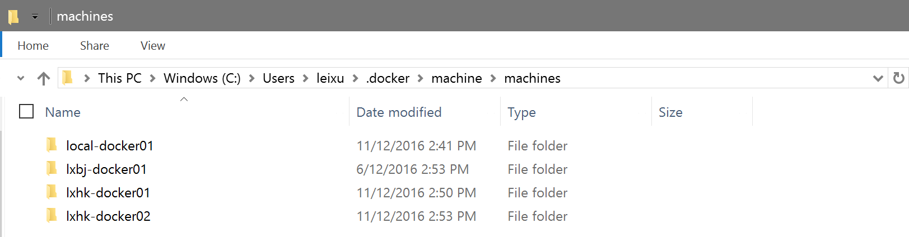

练习三：使用docker-machine命令
~~~~~~~~~~~~~~~~~~~~~~~~~~~~~~~~~~

所谓容器化主机Dockerized Host，就是安装了docker engine的主机，可以使用docker工具进行管理。使用docker来协助开发，我们至少需要本地和云端的容器化主机，本地用于开发，测试，打包；云端的用于生产环境发布。使用容器化主机我们可以将所有的环境标准化，也即是使用统一的docker工具来完成容器在不同环境中的迁移（搬运），真正将容器化开发的优势发挥出来。

docker-machine就是docker工具集中提供的用来管理容器化主机的工具，用来管理运行在不同环境的主机，包括：本地虚拟机，远程虚拟机，公有云中的虚拟机都可以通过一个命令统一进行管理。

在本地虚拟化环境中创建容器化主机
^^^^^^^^^^^^^^^^^^^^^^^^

以下操作可以在Windows操作系统上执行，根据你所使用的是Hyper-V或者Virtual Box你可以分别选择合适的命令创建主机

.. code-block:: shell

    λ docker-machine create -d hyperv --hyperv-virtual-switch "External Wireless" local-docker01

注意以上命令冲使用了--hyperv-virtual-switch执行了hyper-v上的外网网卡，这样才能确保创建好的容器化主机可以正常访问外网，从而可以下载镜像。

以上命令的运行结果如下

.. code-block:: shell

    λ docker-machine create -d hyperv --hyperv-virtual-switch "External Wireless" local-docker01
    Running pre-create checks...
    (local-docker01) Default Boot2Docker ISO is out-of-date, downloading the latest release...
    (local-docker01) Latest release for github.com/boot2docker/boot2docker is v1.12.4-rc1
    (local-docker01) Downloading C:\Users\leixu\.docker\machine\cache\boot2docker.iso from https://github.com/boot2docker/boot2docker/releases/download/v1.12.4-rc1/boot2docker.iso...
    (local-docker01) 0%....10%....20%....30%....40%....50%....60%....70%....80%....90%....100%
    Creating machine...
    (local-docker01) Copying C:\Users\leixu\.docker\machine\cache\boot2docker.iso to C:\Users\leixu\.docker\machine\machines\local-docker01\boot2docker.iso...
    (local-docker01) Creating SSH key...
    (local-docker01) Creating VM...
    (local-docker01) Using switch "External Wireless"
    (local-docker01) Creating VHD
    (local-docker01) Starting VM...
    (local-docker01) Waiting for host to start...
    Waiting for machine to be running, this may take a few minutes...
    Detecting operating system of created instance...
    Waiting for SSH to be available...
    Detecting the provisioner...
    Provisioning with boot2docker...
    Copying certs to the local machine directory...
    Copying certs to the remote machine...
    Setting Docker configuration on the remote daemon...
    Checking connection to Docker...
    Docker is up and running!
    To see how to connect your Docker Client to the Docker Engine running on this virtual machine, run: docker-machine env local-docker01

如果以上命令执行失败，一般是因为下载boot2docker.iso这个文件失败造成的。你可以实现从培训网盘中下载这个文件并放置在 C:\Users\{用户名}\.docker\machine\cache 目录中，这样就可以避免下载动作。

查看docker-machine列表并使用ssh连接
^^^^^^^^^^^^^^^^^^^^^^^^

通过docker-machine创建的容器化主机会在你的计算机上保存记录，可以通过docker-machine ls这个命令查询到所有已经连接到当前计算机的容器化主机。你可以看到以下列表中，我有1台本地hyper-v中的主机和2台运行在微软Azure云中的主机都可以被我本地的docker-machine进行操作。

.. code-block:: shell

    λ docker-machine ls
    NAME             ACTIVE   DRIVER    STATE     URL                         SWARM   DOCKER        ERRORS
    local-docker01   -        hyperv    Running   tcp://192.168.25.108:2376           v1.12.4-rc1
    lxbj-docker01    -        generic   Stopped                                       Unknown
    lxhk-docker01    -        azure     Running   tcp://207.46.131.190:2376           v1.12.3
    lxhk-docker02    -        azure     Running   tcp://207.46.130.226:2376           v1.12.3

这些主机的记录保存在 C:\Users\{当前用户}\.docker\machine\machines 这个目录下

这些目录总保存了使用ssh key-pair连接这些主机所需要的所有证书和密钥文件，需要妥善保存。同时，这样我们也就可以直接ssh远程登录到这些主机上进行操作了

.. code-block:: shell

    λ docker-machine ssh local-docker01
                            ##         .
                    ## ## ##        ==
                ## ## ## ## ##    ===
            /"""""""""""""""""\___/ ===
        ~~~ {~~ ~~~~ ~~~ ~~~~ ~~~ ~ /  ===- ~~~
            \______ o           __/
                \    \         __/
                \____\_______/
    _                 _   ____     _            _
    | |__   ___   ___ | |_|___ \ __| | ___   ___| | _____ _ __
    | '_ \ / _ \ / _ \| __| __) / _` |/ _ \ / __| |/ / _ \ '__|
    | |_) | (_) | (_) | |_ / __/ (_| | (_) | (__|   <  __/ |
    |_.__/ \___/ \___/ \__|_____\__,_|\___/ \___|_|\_\___|_|

    WARNING: this is a build from test.docker.com, not a stable release.

    Boot2Docker version 1.12.4-rc1, build HEAD : 2a30a73 - Thu Dec  8 18:24:06 UTC 2016
    Docker version 1.12.4-rc1, build 0d5bc84
    docker@local-docker01:~$ sudo docker ps
    CONTAINER ID        IMAGE               COMMAND             CREATED             STATUS              PORTS               NAMES
    docker@local-docker01:~$

将docker工具链接到远程docker-machine主机
^^^^^^^^^^^^^^^^^^^^^^^^

由于docker工具本身是通过rest api调用远程主机的docker daemon的接口实现操作，我们可以通过修改本地docker命令所链接的远程主机地址的方式来实现操作目标的切换，docker-machine给我们提供了简化的操作命令。通过 docker-machine env {主机名称} 就可以获取这些链接参数并配置docker工具。

.. code-block:: shell

    C:\Users\leixu
    λ docker-machine env local-docker01
    SET DOCKER_TLS_VERIFY=1
    SET DOCKER_HOST=tcp://192.168.25.108:2376
    SET DOCKER_CERT_PATH=C:\Users\leixu\.docker\machine\machines\local-docker01
    SET DOCKER_MACHINE_NAME=local-docker01
    SET DOCKER_API_VERSION=1.24
    SET COMPOSE_CONVERT_WINDOWS_PATHS=true
    REM Run this command to configure your shell:
    REM     @FOR /f "tokens=*" %i IN ('docker-machine env local-docker01') DO @%i

    C:\Users\leixu
    λ @FOR /f "tokens=*" %i IN ('docker-machine env local-docker01') DO @%i

    C:\Users\leixu
    λ docker ps
    CONTAINER ID        IMAGE               COMMAND             CREATED             STATUS              PORTS               NAMES

你可以看到在以上操作中，我通过调用 @FOR /f "tokens=*" %i IN ('docker-machine env local-docker01') DO @%i 将本地docker命令链接到了local-docker01这台容器主机上，后面的docker ps操作所针对的就是这台主机了。

docker-machine 的其他命令
^^^^^^^^^^^^^^^^^^^^^^^^

docker-machine还提供很多丰富的命令可以帮助你管理容器化主机的生命周期，如：

docker-machine rm {主机名}
    删除主机

docker-machine regenerate-certs {主机名}
    重新生成证书和密钥，如果远程主机的ip地址发生了变化，我们一般需要使用这个命令才能从新连接

docker-machine ip {主机名}
    获取远程主机的ip地址

小结
^^^^^^^^^^^^^^^^^^^^^^^^

至此，我们了解了如何使用docker-machine这个工具来管理多台容器化主机，这个工具可以帮助我们同事管理和操作多台主机，让我们可以把容器输送到不同的环境中运行。

在下一节中，我们将使用docker-compose命令完成单机上的多容器环境编排。

