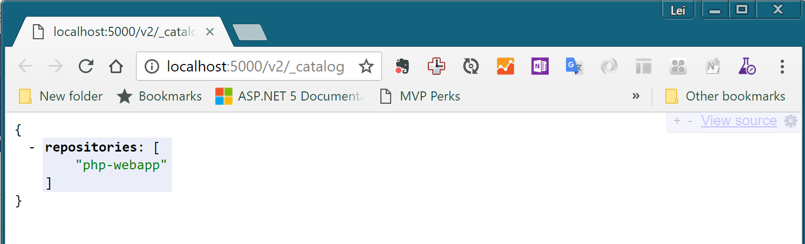

练习五：创建私有容器仓库
~~~~~~~~~~~~~~~~~~~~~~~~~~~~~~~~~~

在前面的实验中，我们一直都会从harbor.devopshub.cn这个站点中拉取各种容器镜像，这个站点就是一个私有的容器镜像仓库。在使用容器进行开发和部署的过程中，私有镜像仓库是必备的基础设施之一。我们使用docker build构建好的镜像需要通过这个仓库作为中转才能被转移到不同的主机上运行。

在这一节的实验中，我们将部署一个私有的容器镜像仓库并在不同的主机中进行部署。

使用docker pull获取registry容器镜像
^^^^^^^^^^^^^^^^^^^^^^^^

docker registry本身也是通过容器方式进行部署的，在docker hub上提供这个镜像，我们为了实验的方便讲此容器放置在了培训专用的仓库上，大家可以通过以下命令拉取这个镜像

.. code-block:: shell

    λ docker pull harbor.devopshub.cn/library/registry
    Using default tag: latest
    latest: Pulling from library/registry
    3690ec4760f9: Already exists
    930045f1e8fb: Pull complete
    feeaa90cbdbc: Pull complete
    61f85310d350: Pull complete
    b6082c239858: Pull complete
    Digest: sha256:1152291c7f93a4ea2ddc95e46d142c31e743b6dd70e194af9e6ebe530f782c17
    Status: Downloaded newer image for harbor.devopshub.cn/library/registry:latest

部署docker registry容器
^^^^^^^^^^^^^^^^^^^^^^^^

使用以下命令完成docker registry的本地部署

.. code-block:: shell

    λ docker run -itd -p 5000:5000 harbor.devopshub.cn/library/registry
    475f759532350258f1b01c6bd844f01617120b89d2b46f4073bb1d922e117564

    λ docker ps
    CONTAINER ID        IMAGE                                  COMMAND                  CREATED                  STATUS              PORTS                    NAMES
    475f75953235        harbor.devopshub.cn/library/registry   "/entrypoint.sh /e..."   Less than a second ago   Up 50 seconds       0.0.0.0:5000->5000/tcp   serene_noether

向私有仓库推送镜像
^^^^^^^^^^^^^^^^^^^^^^^^

为了能够将镜像推送到我们制定的仓库中，我们将借助docker tag命令来从新标识镜像，指定仓库地址并使用docker push命令完成推送。

.. code-block:: shell

    λ docker tag php-webapp:1 localhost:5000/php-webapp:1

    λ docker push localhost:5000/php-webapp:1
    The push refers to a repository [localhost:5000/php-webapp]
    1e6118bd9b21: Pushed
    2e70ba22f008: Pushed
    ffaf2a595e63: Pushed
    983f9b97006e: Pushed
    5a263f0f3836: Pushed
    c4f7d35bb2df: Pushed
    dbf739521f53: Pushed
    3e019add9ad9: Pushed
    18e3751aa1ef: Pushed
    4eb95f543324: Pushed
    a594229cce80: Pushed
    69a54e38f06b: Pushed
    d2808f8124fd: Pushed
    fe4c16cbf7a4: Pushed
    1: digest: sha256:cad34beb069e401143f4201e17c00b791a902259a7ca837c03cdb9fc2dd0b832 size: 3242

注意我们在tag命令中，将镜像名称前面添加了localhost:5000这个标识，这将允许docker push命令讲此容器识别为存放在localhost:5000这个地址上的仓库上的镜像，并推送到这个仓库。完成以上操作后，可以通过浏览器打开 http://localhost:5000/v2/_catalog 就可以看到我们推送的镜像了。

从私有仓库中拉取镜像
^^^^^^^^^^^^^^^^^^^^^^^^

你可以尝试使用以下命令删除本地的php-webapp:1这个镜像，然后再从刚才推送的仓库中拉取

.. code-block:: shell

    λ docker rmi localhost:5000/php-webapp:1
    λ docker rmi php-webapp:1

    λ docker pull localhost:5000/php-webapp:1
    1: Pulling from php-webapp
    1fad42e8a0d9: Already exists
    80da5904bcf7: Already exists
    4a10fe3aed7b: Already exists
    acfc8d985f74: Already exists
    91dcca1807b6: Already exists
    4d14b09788fd: Already exists
    ce00e8bd626b: Already exists
    3fb9a5d71f50: Already exists
    4b446b1983e7: Already exists
    d2750e5e5d54: Already exists
    f542860ae524: Already exists
    f3aa6073e05d: Already exists
    1fe59f2680fe: Already exists
    5682b09a0f60: Pull complete
    Digest: sha256:cad34beb069e401143f4201e17c00b791a902259a7ca837c03cdb9fc2dd0b832
    Status: Downloaded newer image for localhost:5000/php-webapp:1

你会注意到以上拉取过程中只有最后一个镜像层5682b09a0f60真正做了拉取操作，而其他的层都标识别 Already exists，这时因为我们在构建php-webapp这个镜像时所使用的php:7.0-apache镜像仍然在本地存在，这些 Already exists 的镜像层数据就会直接从这个镜像中重复使用，不必再次拉取。

小结
^^^^^^^^^^^^^^^^^^^^^^^^

至此，我们就完成了Docker基本操作的所有试验。通过这些试验，你已经熟悉了使用docker进行容器化开发，打包和部署所需要的基本技能。灵活使用这些工具和命令，你就可以完成应用的容器化打包和部署。

