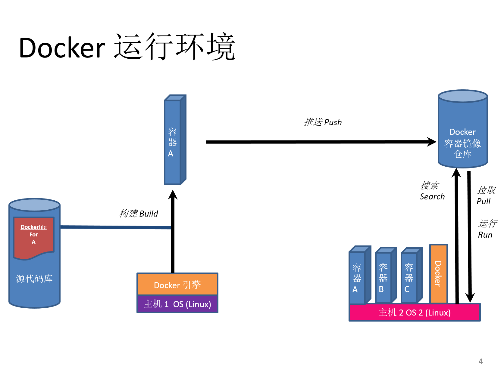

Docker 基本操作
---------------

Docker 运行环境的组成
~~~~~~~~~~~~~~~~~~~~~~~~~~~~~~~~~~

Docker 运行环境如下图，并由代码库，Docker主机(运行了docker daemon)的服务器和镜像仓库这3个最主要的部分组成。

代码库
    Git / SVN 等

Docker 引擎
    Linux: docker daemon 驻守程序， Windows: com.docker.service 服务
 
Docker 容器化主机
    运行了以上docker引擎的服务器（VM或实体机）

镜像仓库
    用于容器镜像存储和版本控制的服务器

开发、测试环境
    Windows: Docker for Windows 或 Docker Toolbox， macOS：Docker for Mac，Linux: Docker 原生支持 

生产运维环境
    容器化主机，容器化编排引擎：Apache Mesos / k8s / Docker Swarm

本部分实验内容将指导你使用最基本的docker, docker-machine和docker-compose命令来管理这套环境。请参考 常见问题及解决方案 | 安装Docker for Windows 或 安装Docker Toolbox 预先配置您的本地环境。

**练习列表**

.. toctree::
   :titlesonly:

   docker-commands
   docker-build-commands
   docker-machine-commands
   docker-compose-commands
   docker-registry

