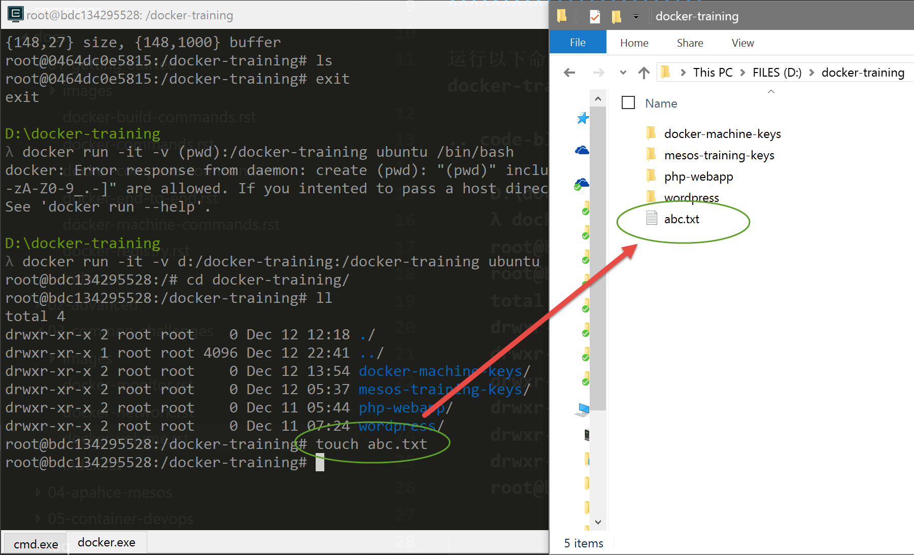

练习一：熟悉并使用volume持久化容器数据
~~~~~~~~~~~~~~~~~~~~~~~~~~~~~~~~~~~~~~~~~~

想要了解Docker Volume，首先我们需要知道Docker的文件系统是如何工作的。Docker镜像是由多个文件系统（只读层）叠加而成。当我们启动一个容器的时候，Docker会加载只读镜像层并在其上添加一个读写层。如果运行中的容器修改了现有的一个已经存在的文件，那该文件将会从读写层下面的只读层复制到读写层，该文件的只读版本仍然存在，只是已经被读写层中该文件的副本所隐藏。当删除Docker容器，并通过该镜像重新启动时，之前的更改将会丢失。在Docker中，只读层及在顶部的读写层的组合被称为Union File System（联合文件系统）。

为了能够保存（持久化）数据以及共享容器间的数据，Docker提出了Volume的概念。简单来说，Volume就是目录或者文件，它可以绕过默认的联合文件系统，而以正常的文件或者目录的形式存在于宿主机上。

01. 启动容器并挂接本地文件系统
^^^^^^^^^^^^^^^^^^^^^^^^

运行以下命令启动容器，并将本地的docker-training目录内容挂接到容器内的docker-training目录中。

.. code-block:: shell

    D:\docker-training
    λ docker run -it -v d:/docker-training:/docker-training ubuntu /bin/bash
    root@bdc134295528:/# cd docker-training/
    root@bdc134295528:/docker-training# ll
    total 4
    drwxr-xr-x 2 root root    0 Dec 12 12:18 ./
    drwxr-xr-x 1 root root 4096 Dec 12 22:41 ../
    drwxr-xr-x 2 root root    0 Dec 12 13:54 docker-machine-keys/
    drwxr-xr-x 2 root root    0 Dec 12 05:37 mesos-training-keys/
    drwxr-xr-x 2 root root    0 Dec 11 05:44 php-webapp/
    drwxr-xr-x 2 root root    0 Dec 11 07:24 wordpress/
    root@bdc134295528:/docker-training# touch abc.txt
    root@bdc134295528:/docker-training# 

注意以上在容器内执行了 touch abc.txt 命令，创建了一个abc.txt的文件。现在从Windows上打开这个文件夹，也同样可以看到abc.txt文件。

你也可以尝试在Windows上直接编辑这个文件，然后在容器内执行 cat abc.txt，就可以看到修改过的内容了。

02. 使用数据卷进行应用开发和调试
^^^^^^^^^^^^^^^^^^^^^^^^

进入之前我们创建好的php-webapp目录，然后执行以下命令，将src目录挂接到php:7.0-apache 这个容器的/var/www/html目录中。

.. code-block:: shell

    D:\docker-training\php-webapp
    λ docker run -itd -v d:/docker-training/php-webapp/src:/var/www/html -w /var/www/html --rm -p 8080:80 php:7.0-apache
    68354123d5e20c4d8b76070933cd814f0332c3d25ae95d56da9475be9944614f

执行完毕后，打开浏览器并导航到 http://localhost:8080 ，同时使用Visual Studio Code 编辑index.php文件，刷新浏览器即可看到实时的编辑结果。

.. figure:: images/volume-02-php-webapp.png

03. 使用数据卷容器
^^^^^^^^^^^^^^^^^^^^^^^^

我们也可以通过 --volumes-from 这个参数将另外一个容器的数据卷目录挂接过来，如下：

.. code-block:: shell

    D:\docker-training\php-webapp
    λ docker create -v d:/docker-training/php-webapp/src:/var/www/html --name php-webapp-data php:7.0-apache /bin/true
    0f46d6f1cd1e9f71b107b26af8a7450d4407efc4c1e53e70c32a48bc5260a35d

    D:\docker-training\php-webapp
    λ docker run -itd --volumes-from php-webapp-data --name php-webapp-run -w /var/www/html --rm -p 8080:80 php:7.0-apache
    f53035d6a573d41ffaf5c3ebf1e5dd13798c1b47750f5e7d493c0eb8a776500c

注意第一个命令我们使用了docker create命令，这个命令只是创建了容器但是并没有运行容器。这样做的原因是因为第一个叫做php-webapp-data的容器只是为了给其他容器提供数据存储使用，本身并不需要运行。

使用数据卷容器，我们可以让其他容器使用同一的方式来运行，而不必关心数据来自磁盘的那个位置。同时，只要我们不使用docker rm命令销毁数据卷容器，那么这些数据就会一直存在(即便我们在执行docker create的时候不使用-v挂接主机目录)。这样，我们就可以随时启动，停止和销毁运行的容器，并在需要的时候挂接数据卷容器进行数据备份和迁移。

小结
^^^^^^^^^^^^^^^^^^^^^^^^

至此，你应该对于如何对容器数据进行持久化有了初步的了解，灵活运用数据卷可以帮助我们更好的管理容器中的数据，完成如数据备份，数据迁移，容器转移等操作。

