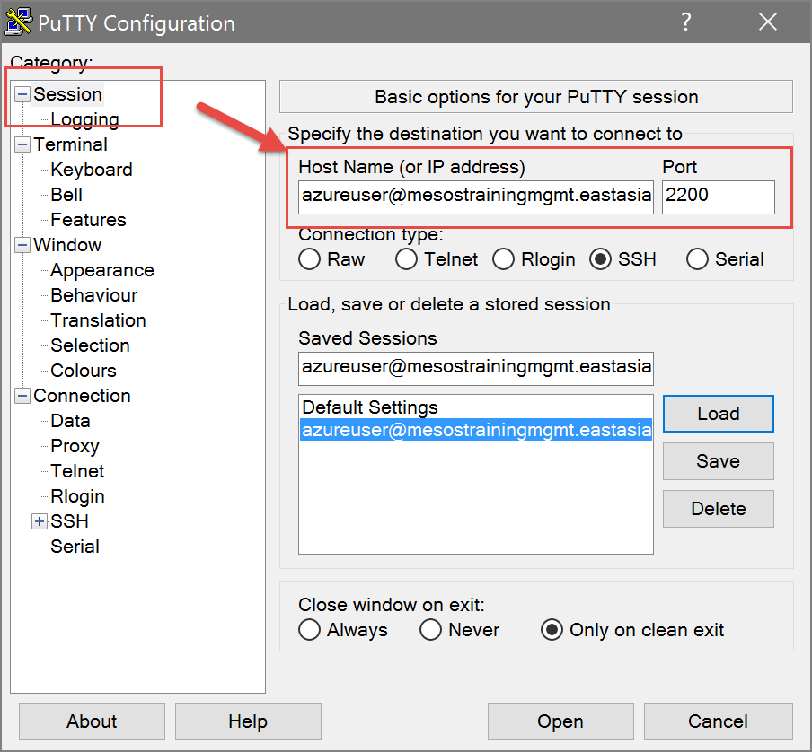
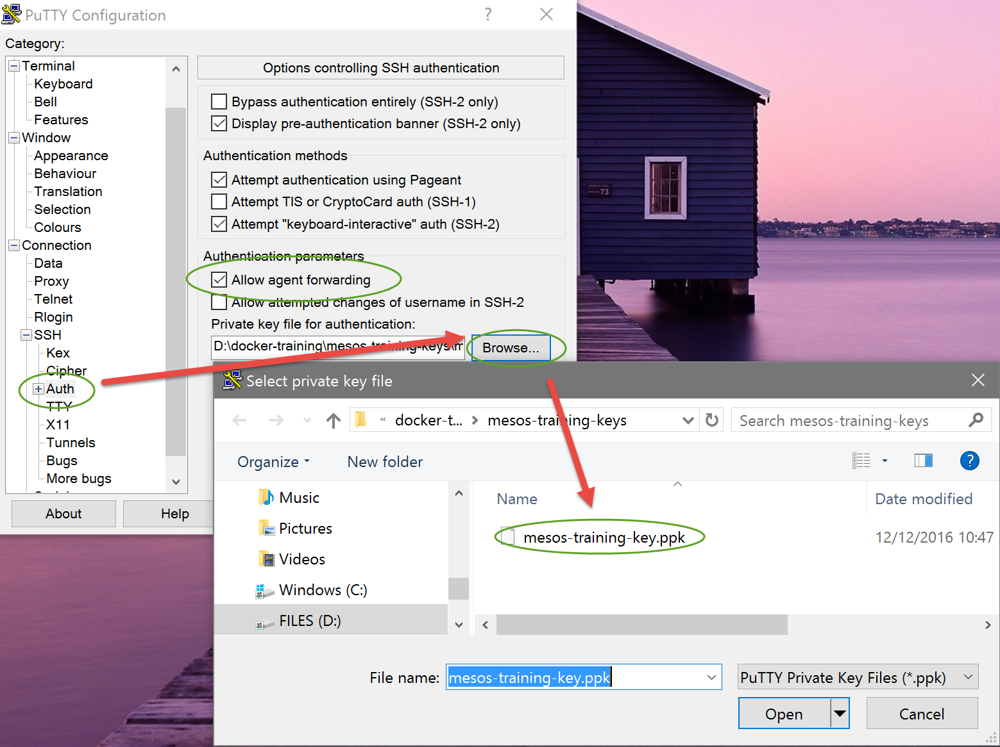
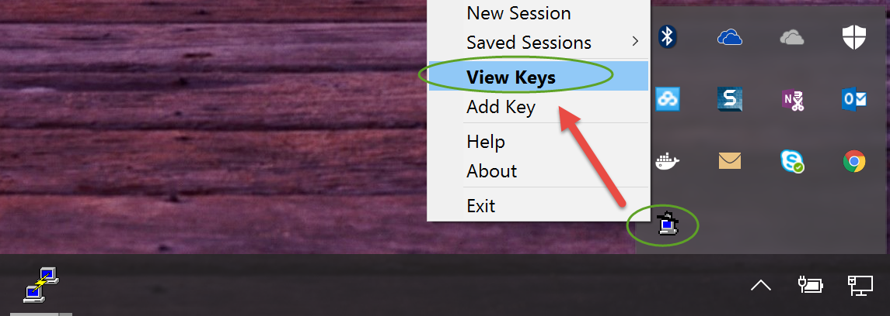
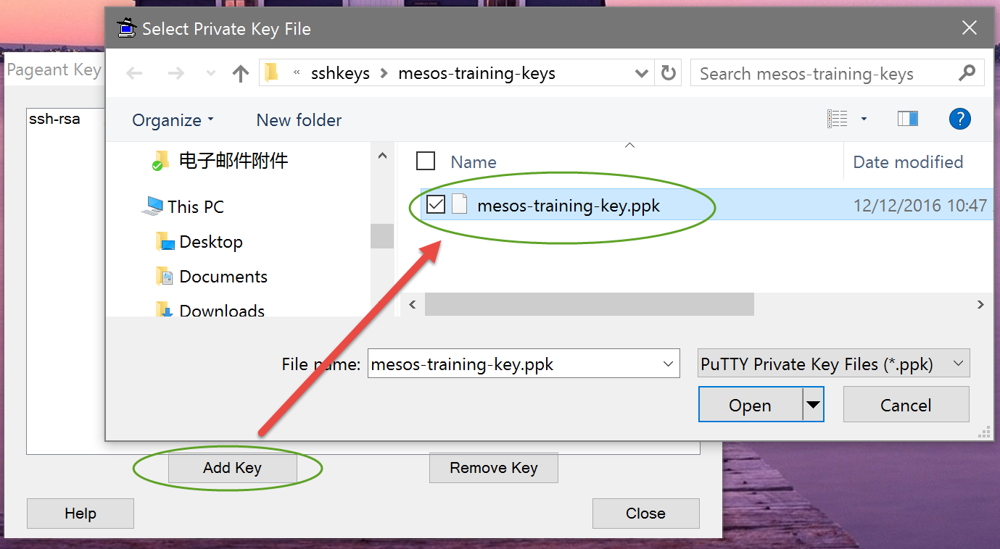
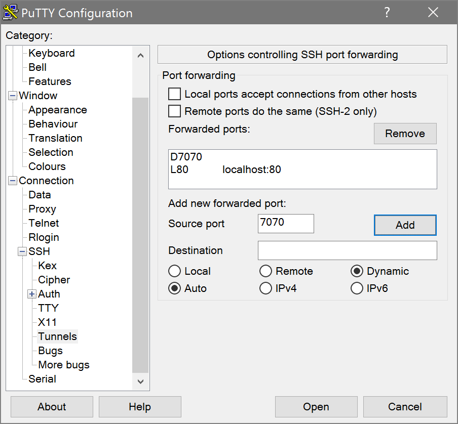
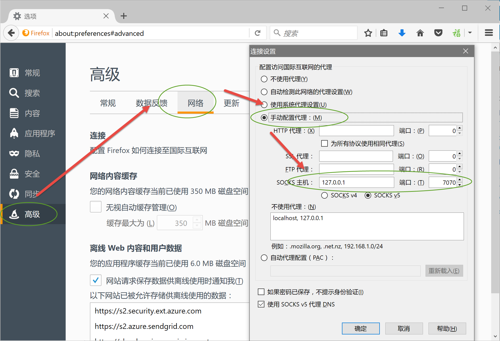
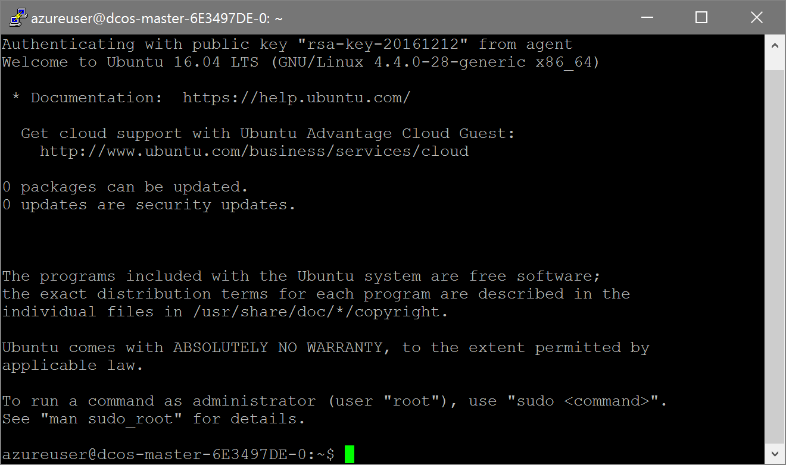
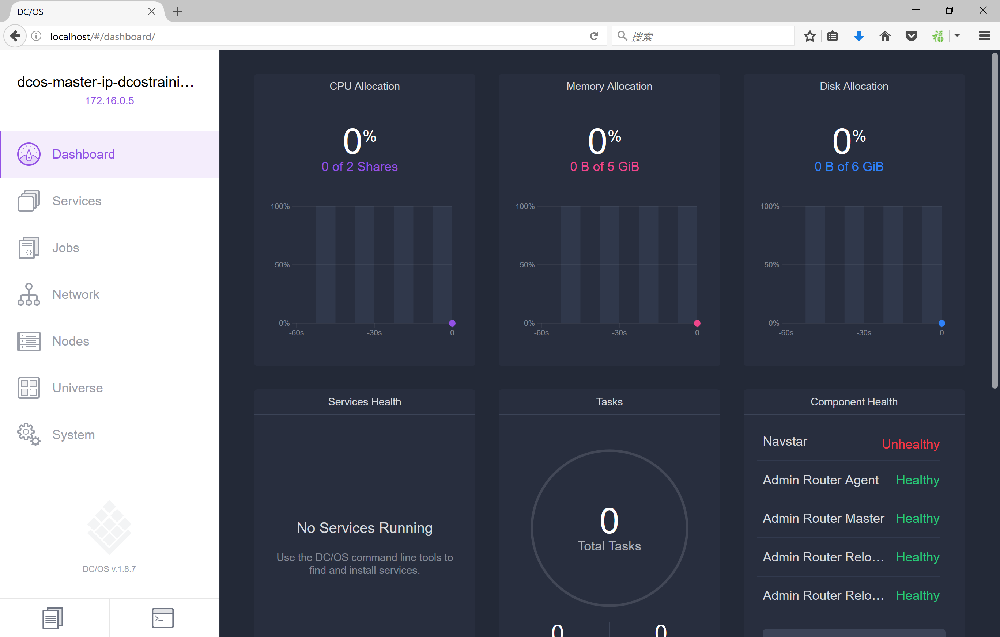

练习一：连接Mesos(DCOS)集群
~~~~~~~~~~~~~~~~~~~~~~~~~~~~~~~~~~

为了能够操作运行在Azure容器服务中的DCOS集群，我们需要在本地计算机和DCOS集群的master节点之间创建一个SSH隧道，并将所有流量导入到这个隧道，这样我们才可以通过本地计算机操作DCOS集群。

完成以上操作，请从培训网盘下载以下文件并从讲师处获取ssh-key文件和DCOS地址

- Firefox Setup 50.0.2.exe
- putty.zip

请预先安装好firefox并将putty.zip解压。

使用putty配置ssh连接
^^^^^^^^^^^^^^^^^^^^^^^^

将从讲师处获得的ssh-key文件保存到docker-training目录中，打开putty.exe并按照以下方式进行配置

1. 填写DCOS集群管理地址

连接地址
    azure@{讲师提供的dcos地址}

端口号
    2200

2. ssh-key配置

选择保存在docker-training目录中的mesos-training-key.ppk文件
勾选 Allow agent forwarding 

3. 配置Agent forwarding

启动putty目录中的PAGEANT.EXE，并右键点击系统托盘中的小图标，选择View Keys

在弹出的窗口中选择 Add Key 并选择同样的ppk文件

4. 配置ssh隧道

回到putty.exe的窗口，按照以下进行配置

这里我们配置了2个隧道，一个用于通过 http://localhost 连接DCOS管理界面，另外一个提供给firefox作为连接集群内资源的通道

配置firefox上的ssh代理
^^^^^^^^^^^^^^^^^^^^^^^^

在firefox中打开 选项 | 高级 | 网络 并按照以下配置

使用firefox连接到DCOS管理界面
^^^^^^^^^^^^^^^^^^^^^^^^

在putty上完成配置后，点击 Open，在弹出的Security Alert中点击Yes，可以看到如下窗口

在firefox中打开 http://localhost 可以看到DCOS的管理界面

小结
^^^^^^^^^^^^^^^^^^^^^^^^

至此，我们就完成了本地环境到DCOS集群的连接，可以开始后续的实验了。
