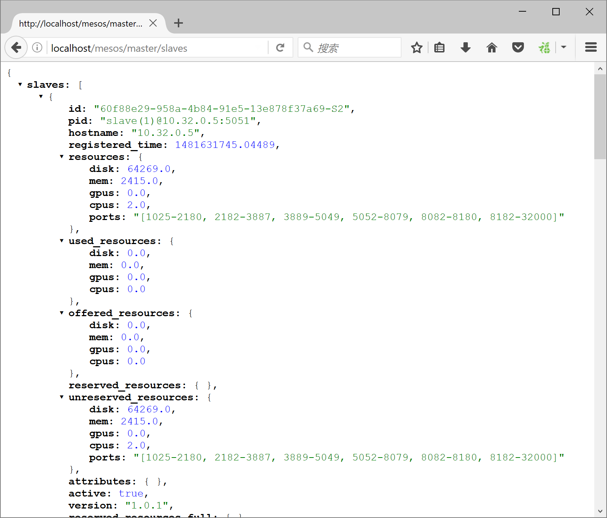
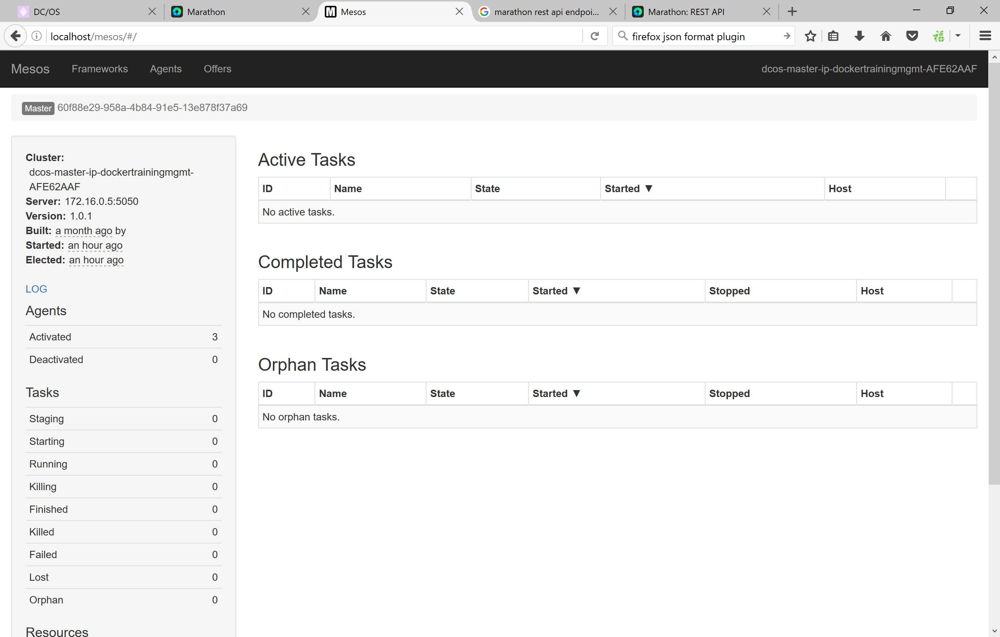
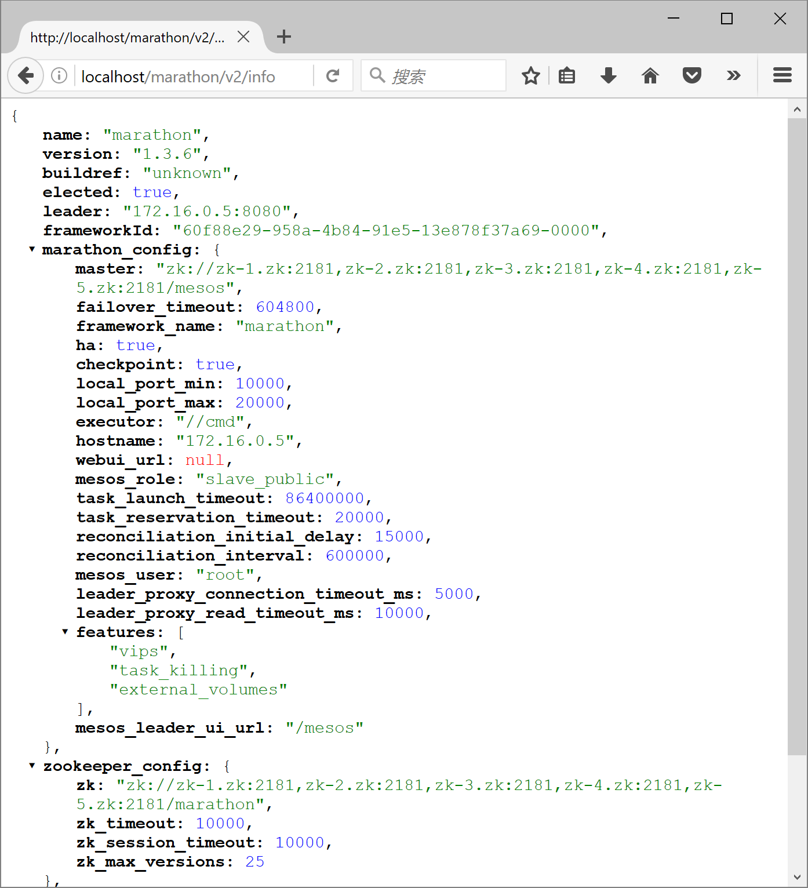
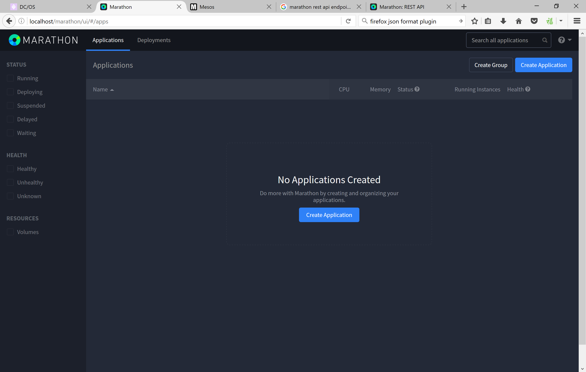

练习二：熟悉DCOS集群
~~~~~~~~~~~~~~~~~~~~~~~~~~~~~~~~~~

在我们开始向DCOS集群部署应用之前，先通过一些接口熟悉一下集群的基本情况。DCOS提供了很多服务终结点(endpoints)，可以通过REST API进行访问。

01. 获取Mesos集群信息
^^^^^^^^^^^^^^^^^^^^^^^^

使用命令行执行以下命令

.. code-block:: shell

    curl http://localhost/mesos/master/slaves

或通过浏览器直接访问 http://localhost/mesos/master/slaves

其他常用的Mesos服务终结点还包括

http://localhost/mesos/roles
http://localhost/mesos/frameworks
http://localhost/mesos/tasks
http://localhost/mesos/flags

完整的终结点列表可以访问 http://mesos.apache.org/documentation/latest/endpoints/

另外可以通过以下地址直接访问mesos管理界面

http://localhost/mesos 

02. 获取Marathon信息
^^^^^^^^^^^^^^^^^^^^^^^^

使用命令行执行以下命令

.. code-block:: shell

    curl http://localhost/marathon/v2/info

http://localhost/marathon/v2/info

或通过浏览器直接访问 http://localhost/marathon/v2/info

其他常用的Marathon服务终结点还包括

http://localhost/marathon/v2/leader
http://localhost/marathon/v2/apps
http://localhost/marathon/v2/tasks

完整的终结点列表可以访问 https://mesosphere.github.io/marathon/docs/rest-api.html

另外可以通过以下地址直接访问Marathon管理界面

http://localhost/marathon

小结
^^^^^^^^^^^^^^^^^^^^^^^^

现在，我们已经对DCOS集群上的主要服务终结点有了基本了解，下面让我们开始在DCOS上部署一些应用。

