练习三：使用DCOS运行应用
~~~~~~~~~~~~~~~~~~~~~~~~~~~~~~~~~~

在DCOS(Mesos)上，我们运行服务(持续运行)或者任务(单次或按照计划)。这个实验中我们将通过一个简单的命令行进程和一个容器来熟悉这2中运行模式。

01. 运行一个服务进程
^^^^^^^^^^^^^^^^^^^^^^^^

在DCOS首页上点击 Service | Deploy Service 

.. figure:: images/03-simplejob-01-services.png

在弹出的页面中输入

ID: 

    myfirstapp

Command: 

.. code-block:: shell

    /bin/bash -c "for i in {1..5}; do echo MyFirstApp $i; sleep 1; done"

.. figure:: images/03-simplejob-01-start.png

然后单击Deploy 

服务启动后，可以在列表中看到此服务的运行状态。

.. figure:: images/03-simplejob-01-services.png

02. 对应用进行扩容
^^^^^^^^^^^^^^^^^^^^^^^^

在myfirstapp上点击齿轮标志，并选择 Scale 

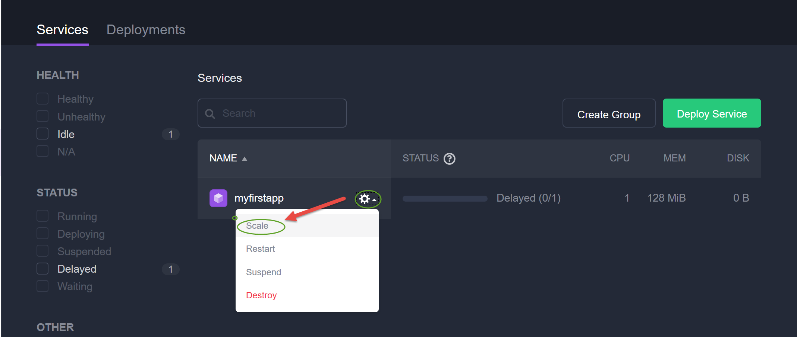

输入2，并点击Scale Service

.. figure:: images/03-simplejob-02-scale-scale.png

稍等几秒钟，你会注意到此服务的运行状态发生变化，现在有2个节点在运行。

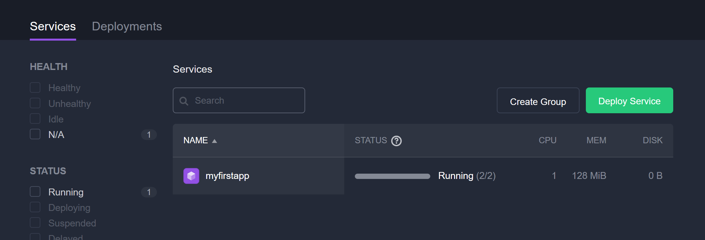

此时，可以切换到Dashboard上看到集群状态的变化

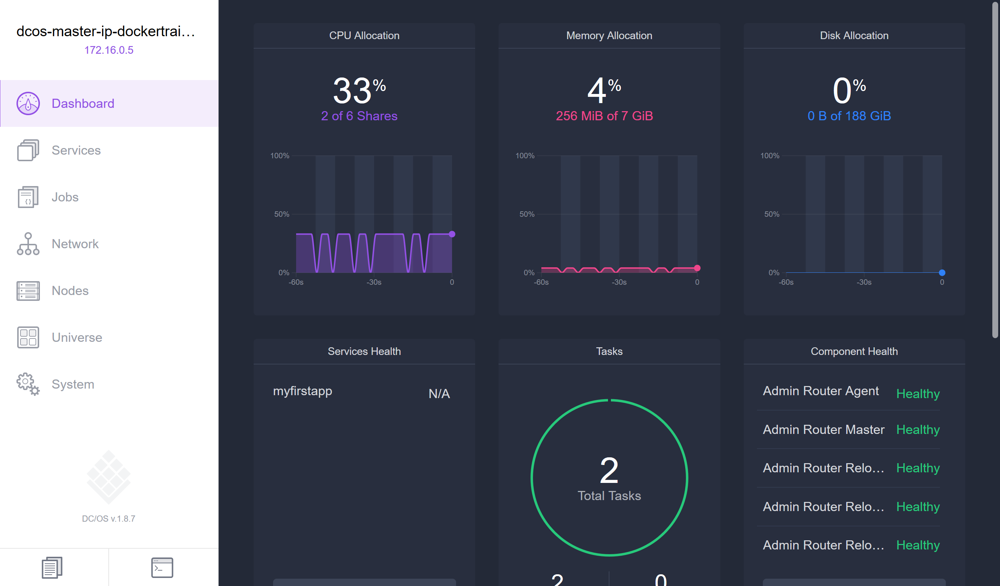

再次尝试将此服务扩容到3个节点，你会注意上Mesos无法完成这次扩容。这是因为我们对此服务的定义是要求每个节点使用1个CPU，而我们的集群中只有2个单核CPU的Agents，所以Mesos无法完成这次扩容。

你可以尝试修改此服务的CPU限制(比如修改为0.1)，然后再次尝试扩容到更多节点数，理论上你应该可以运行20个每个0.1CPU的节点。

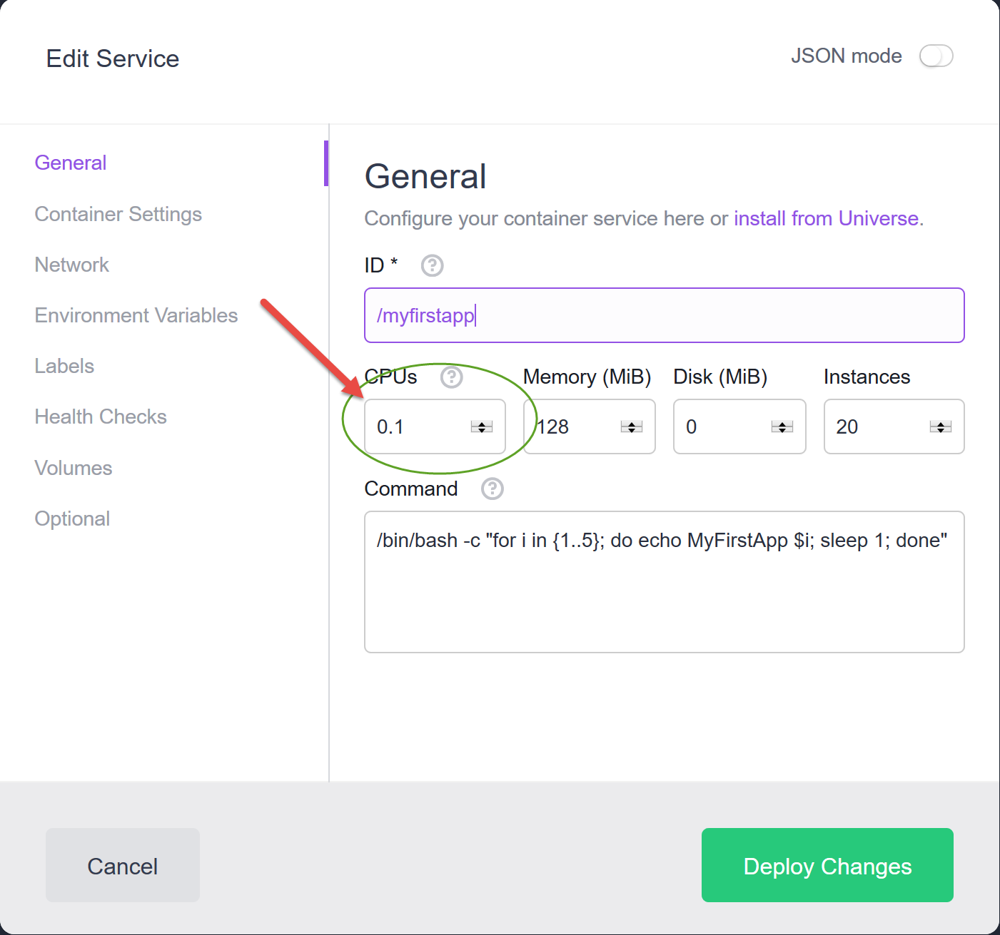

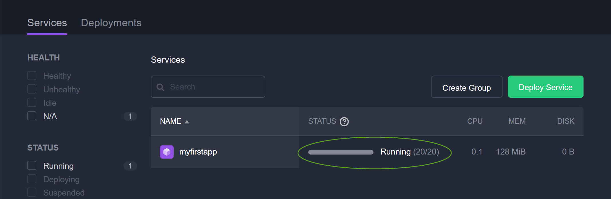

03. 运行单次任务
^^^^^^^^^^^^^^^^^^^^^^^^

在DCOS首页左侧点击Jobs，并点击New Job，输入

ID
    Myjob

Command

.. code-block:: shell

    /bin/bash -c "for i in {1..5}; do echo MyFirstApp $i; sleep 1; done"

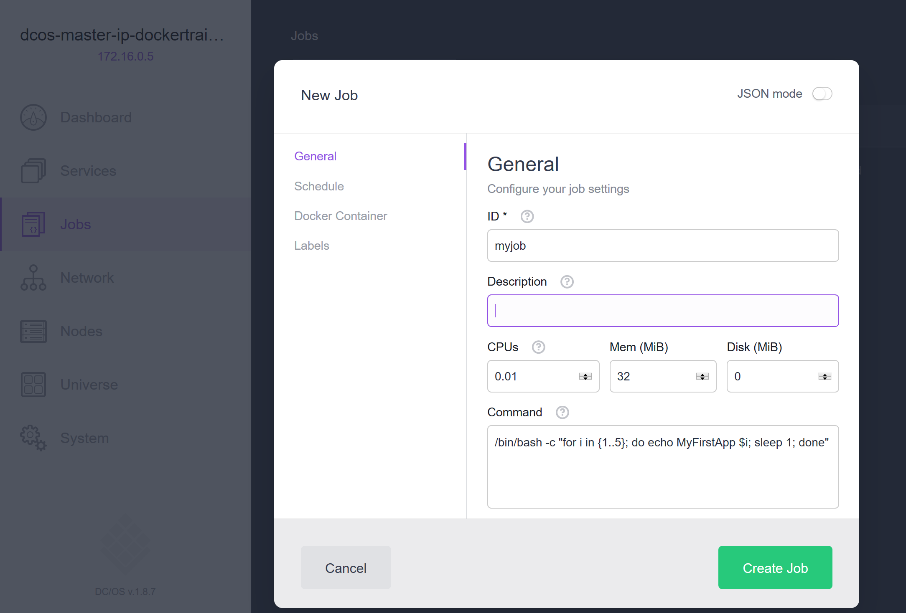

在 myjob 页面上点击 Run Now，任务会被启动，你可以尝试多次点击运行。

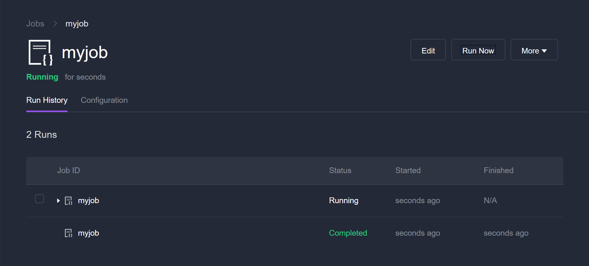

03. 运行周期性任务
^^^^^^^^^^^^^^^^^^^^^^^^

在myjob页面上点击 Edit 按钮，切换到Schedule页面，在CRON Scheule中输入：* * * * 

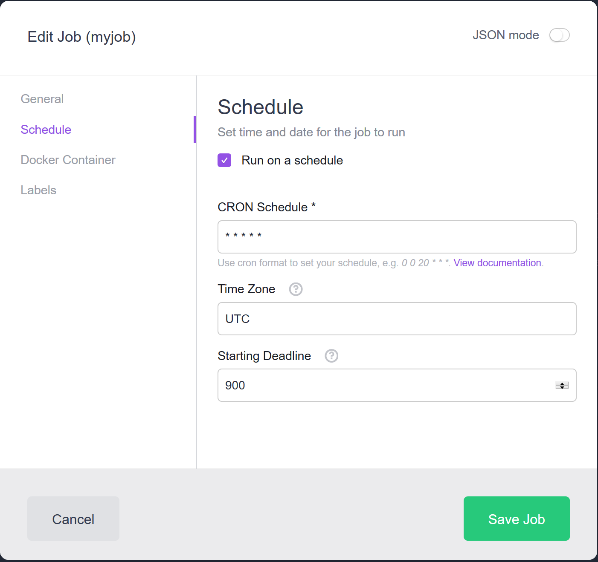

等待几分钟，你会注意到myjob以每分钟一次的频率在运行。

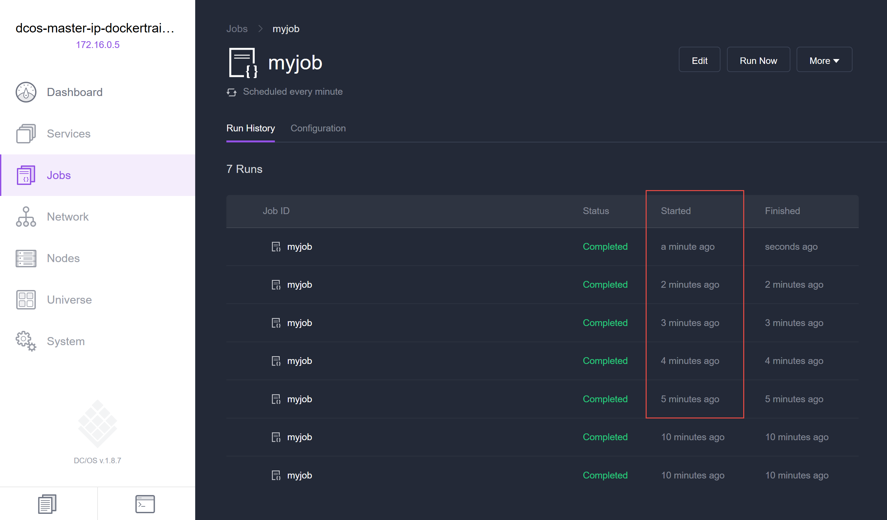

关于如何设置CRON Schedule可以参考 https://crontab.guru/

04. 使用容器运行服务
^^^^^^^^^^^^^^^^^^^^^^^^

*执行以下操作前请将之前的myfistapp服务销毁掉

在DCOS首页上点击Service | Deploy Service 

键入 /hello-world-container作为ID，并限制CPU为0.5

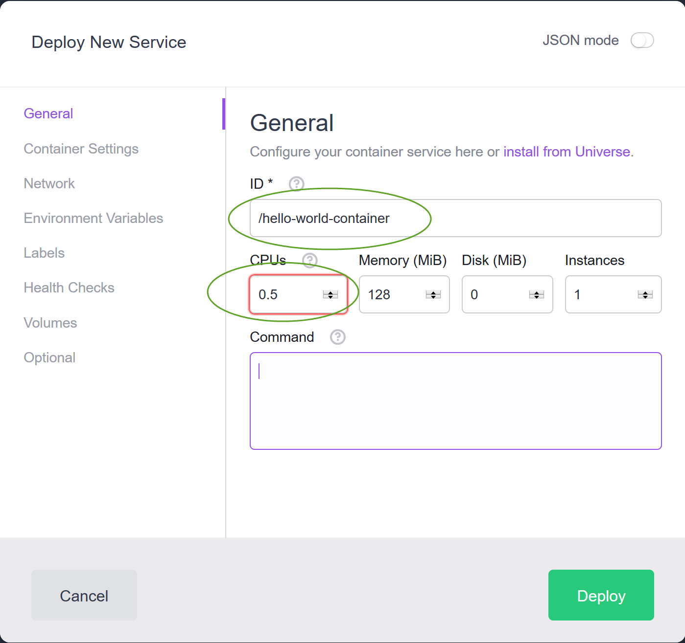

在 Container 页面中输入 hello-world 作为镜像名称

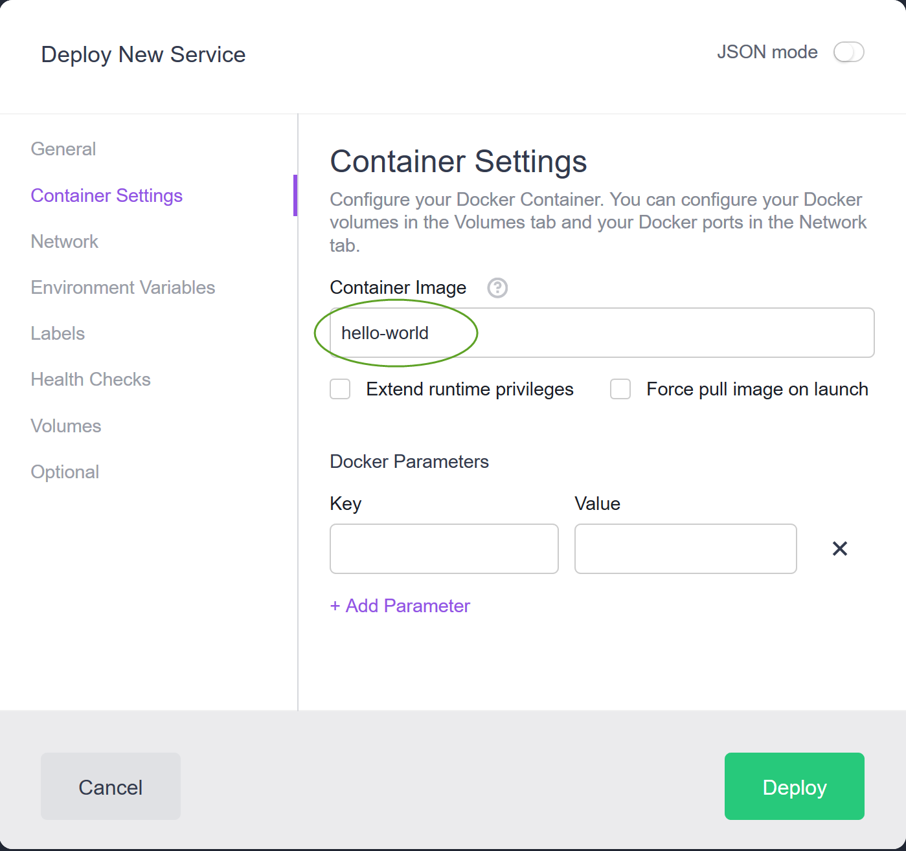

单击 Deploy 

你会注意到这个容器会有非常短暂的时间处于Running状态，这是因为Hello-World容器只会输出一些信息然后便马上退出。但是Mesos会持续不断的尝试启动这个容器以保持1个实例的状态。如果你能捕捉到一个正在运行的实例，进入log页面。可以看到如下输出。

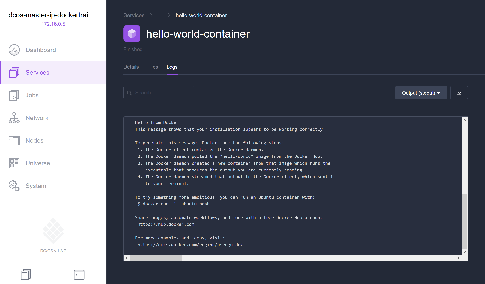

小结
^^^^^^^^^^^^^^^^^^^^^^^^

DCOS 在默认安装了Marathon和Chronos这2个Framework之后，可以让我们运行长进程(服务)或者任务(单次或按照计划)，而我们不必关心这些进程在集群中的那个节点上运行，这给我们充分调度集群资源提供了便利。

