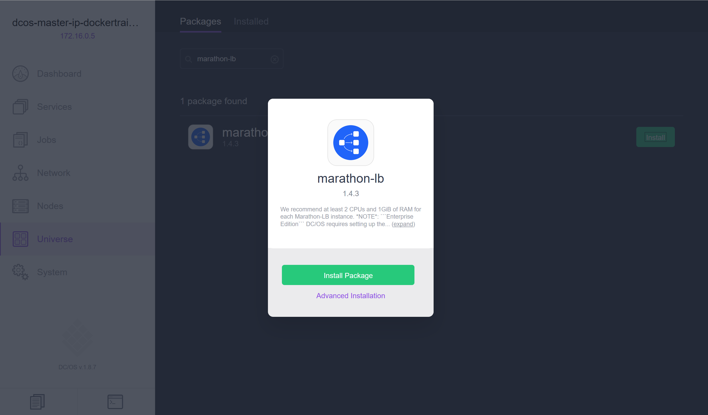
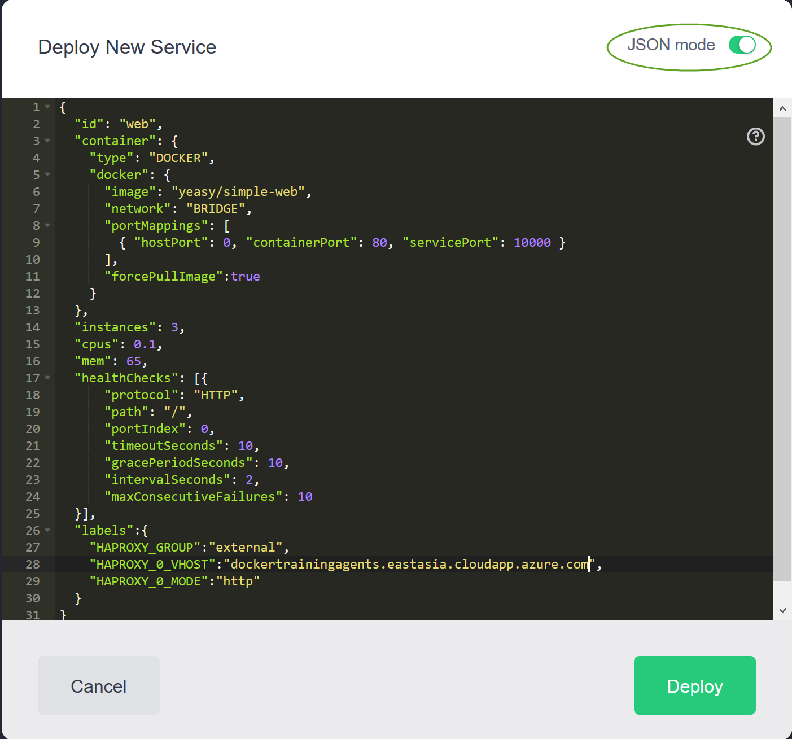
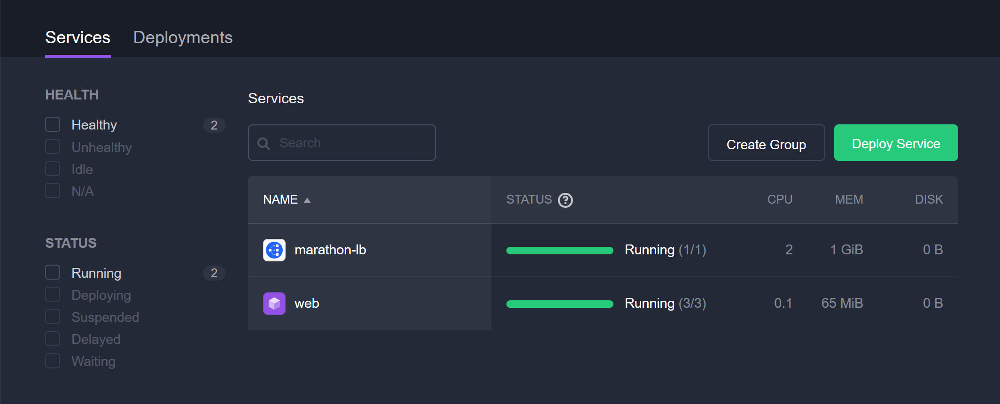
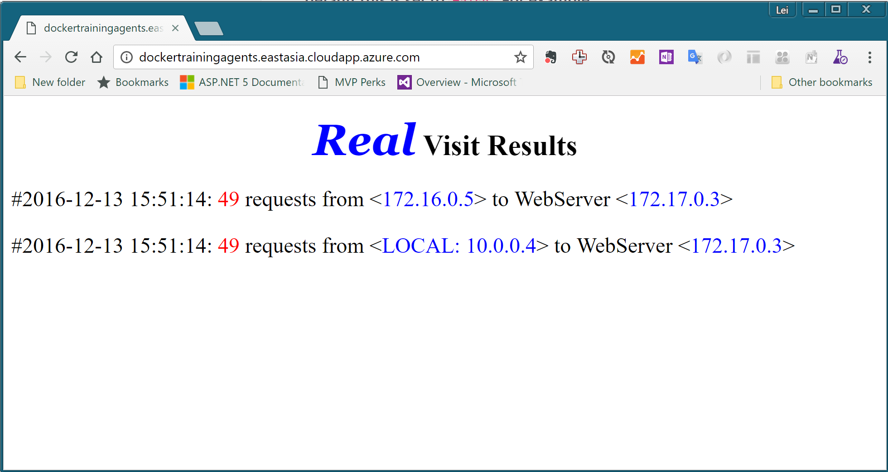

练习四：使用DCOS运行负载均衡的Web服务
~~~~~~~~~~~~~~~~~~~~~~~~~~~~~~~~~~

这个实验中，我们将使用DCOS部署一个40节点的Web App并配置Marathon-lb对其进行负载均衡，同时允许用户通过DCOS的外部地址进行访问。

01. 部署Marathon-lb服务
^^^^^^^^^^^^^^^^^^^^^^^^

在DCOS首页左侧点击Unverise，并搜索Marathon-lb，然后点击安装。

等待此服务进入Running状态。

02. 部署Web App服务
^^^^^^^^^^^^^^^^^^^^^^^^

在Service页面中点击 Deploy Service，切换至Json模式，然后复制一下内容到页面中，注意替换一下{DOCS集群的agentFQDN}为我们的集群agent对外dns地址。

.. code-block:: shell

    {
    "id": "web",
    "container": {
        "type": "DOCKER",
        "docker": {
        "image": "yeasy/simple-web",
        "network": "BRIDGE",
        "portMappings": [
            { "hostPort": 0, "containerPort": 80, "servicePort": 10000 }
        ],
        "forcePullImage":true
        }
    },
    "instances": 3,
    "cpus": 0.1,
    "mem": 65,
    "healthChecks": [{
        "protocol": "HTTP",
        "path": "/",
        "portIndex": 0,
        "timeoutSeconds": 10,
        "gracePeriodSeconds": 10,
        "intervalSeconds": 2,
        "maxConsecutiveFailures": 10
    }],
    "labels":{
        "HAPROXY_GROUP":"external",
        "HAPROXY_0_VHOST":"{DOCS集群的agentFQDN}",
        "HAPROXY_0_MODE":"http"
    }
    }

完成后，等待此服务进入Runing状态。

此时，可以使用浏览器导航到 http://{DOCS集群的agentFQDN} 地址上，看到一下页面

03. 对web服务进行扩容
^^^^^^^^^^^^^^^^^^^^^^^^

现在你可以尝试对这个web服务进行扩容，在我们的实验环境上你应该可以最大扩容到40个节点。完成刷新浏览器中的页面，你会看到基本上每次刷新WebServer的地址都会发生变化，这是因为我们的负载均衡在起作用。

04. Azure ACS 上的DCOS负载均衡架构
^^^^^^^^^^^^^^^^^^^^^^^^

在以上配置中，我们的环境中分别由Azure的负载均衡器和运行在DCOS上面的Marathon-lb服务系统工作完成了外部流量向内部运行的container上面的负载均衡。此架构图如下：

.. figure:: images/04-webapp-04-acs-dcos-lb.png

小结
^^^^^^^^^^^^^^^^^^^^^^^^

至此，我们就完成了在DCOS上面部署负载均衡的Web服务的操作。

