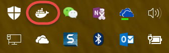

安装Docker for Windows
~~~~~~~~~~~~~~~~~~~~~~~~~~~~~~~~~~

.. attention::
    
    安装前请确认：
    
        - 本地操作系统为Windows 10并安装了最新更新。
        - Windows 10上面已经启用了Hyper-V（如果没有启用，Docker for Windows会自动启用，不过安装过程会需要从新启动电脑）
        - 如果您使用的不是Windows 10操作系统，请参考以下安装Docker Toolbox部分。注意Docker for Windows和Docker Toolbox只需要安装一个即可。Docker Toolbox是为Windows 10以下版本的Windows环境提供的Docker工具

双击文件InstallDocker.msi启动Docker安装向导。安装后启动Docker，可以在右下角看到运行的Docker托盘程序。

请点击这里 http://pan.baidu.com/s/1kU7wmA7 下载预装软件，密码：密码：tsts。

文件列表：

- cmder.zip
- InstallDocker.msi 
- VSCodeSetup-1.7.2.exe

安装Docker Toolbox
~~~~~~~~~~~~~~~~~~~~~~~~~~~~~~~~~~

.. attention::
    
    安装前请确认：
    
        - 本地操作系统为Windows 7/8或Windows Server 2012 R2并安装了最新更新。
        - Windows上面已经没有启动Hyper-V（因为Docker Toolbox会使用Virtual Box作为虚拟化工具，与Hyper-V不兼容）
        - 如果您使用的是Windows 10操作系统，请参考以上安装Docker for Windows部分。注意Docker for Windows和Docker Toolbox只需要安装一个即可。Docker

双击文件DockerToolbox-1.12.3.exe启动Docker安装向导。安装后启动Docker，可以在右下角看到运行的Docker托盘程序。

请点击这里 http://pan.baidu.com/s/1kU7wmA7 下载预装软件，密码：密码：tsts。

文件列表：

- cmder.zip
- DockerToolbox-1.12.3.exe
- VirtualBox-5.1.10-112026-Win.exe
- VSCodeSetup-1.7.2.exe