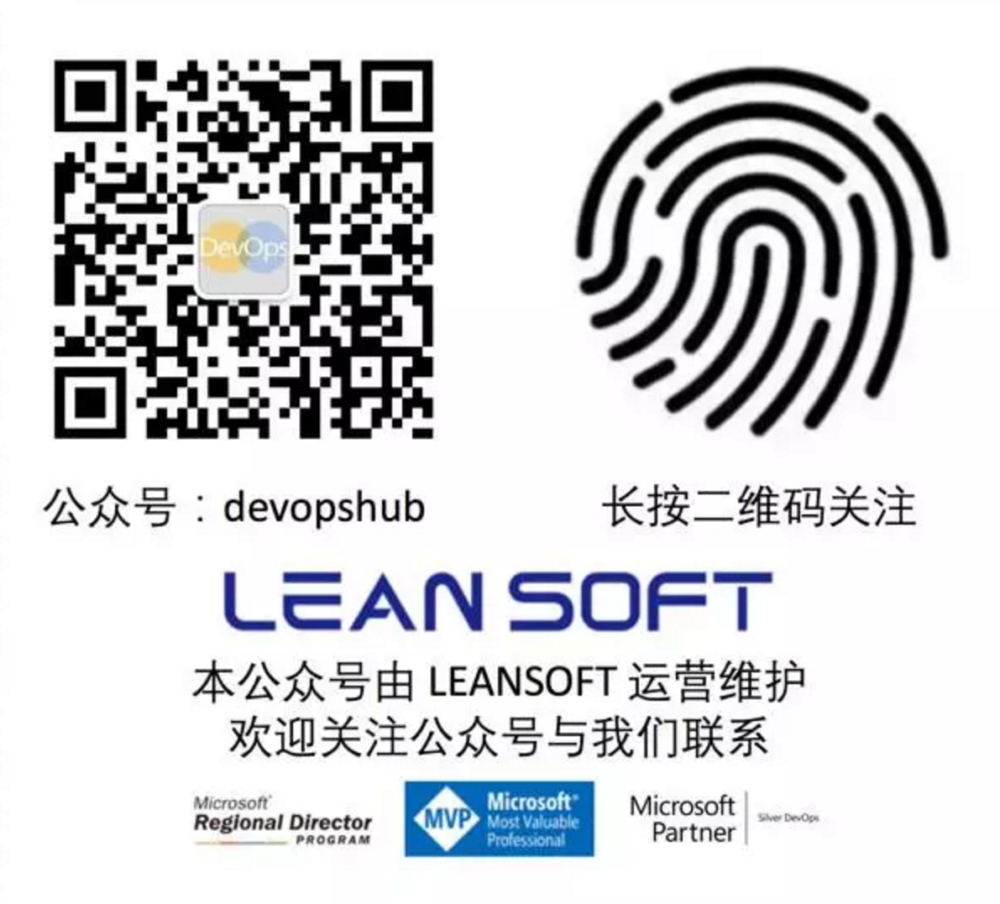

.. _rst_docker-training-labs

Docker 培训动手实验文档
=================

.. attention::
    
    本文档使用reST格式编写，内容托管于GitHub。文档内容正在持续编写中，如果您在使用中遇到问题，可以通过扫描文末我们的微信公众的二维码来提交问题。
    
    
    本文档提供2个主要版本:
    
    - stable: 稳定版本，按照发布日期进行tag，如：v2016.12.10 表示所对应的是 2016年12月10日发布的版本
    - latest: 最新版本，持续更新。
    
    版本记录：
    
    - v2016.12.12: 当前最新稳定版本

概述
-----

本文档配合《构建容器化DevOps数据中心》培训提供。从Docker的基本功能和操作开始，讲解Docker背后的容器化核心技术cgroup和namespace,分析docker容器化应用所带来的问题和解决方案；最后结合 Apache Mesos 和Marathon为您介绍如何在企业中构建基于混合云的DevOps数据中心，并对其主要应用场景进行演示和讲解。

背景
------

现代软件开发和计算机技术的快速发展造成了大量异构系统的出现，这给应用开发，测试和部署都带来了巨大的复杂度，如何有效的管理这种复杂度同时保持开发和运维的效率是急待解决的问题。
容器化技术在主机时代已经被证明是非常有效的应用隔离技术，可以帮助企业有效的利用计算资源，同时提供很好的敏捷特性。随着Linux在企业级系统中应用的增多，虚拟化的广泛使用和云计算的兴起，Docker这种围绕容器技术构建的工具/生态系统被广泛接受，成为解决异构系统上应用开发和运维问题的最佳选择，同时也为企业构建混合云数据中心提供了更好的选择和可能性。
Docker所代表的容器化分布式数据中心运维方案同时也带来了一些新的问题，比如应用编排，集群管理，作业控制，资源监控等。当前的解决方案主要有Mesos, Kubernetes和Swarm;其中来自Apache基金会的Mesos/Marathon是唯一经过了Twitter/airbnb等大型企业上万台主机集群环境验证的成熟的企业级开源解决方案。

目标人群
---------

本培训为300级别培训，适合企业IT应用开发和运维人员，参训者需要具备基础的Linux/Windows操作系统知识，对网络，存储，虚拟化，云计算和应用开发，测试，部署流程较为熟悉，并具备实际操作经验。

:更新日期: |today|
:作者: **LEANSOFT** 
:主页: `DevOps Hub <http://devopshub.cn>`_

内容
-----

.. toctree::
    :titlesonly:
    
    01-getting-started/index
    02-advanced/index
    03-common-challenges/index
    04-apahce-mesos/index
    05-container-devops/index
    labs/index
    

常见问题
---------
.. toctree::
    :titlesonly:
    
    faq/index

反馈
-----

如果您在使用此文档的过程中遇到任何问题，请扫描以下二维码关注我公司公众号，并通过留言的方式与我们取得联系，我们会在第一时间回复您的问题。

版权
-----

本网站内容由LEANSOFT提供并拥有版权，访问者可将本网站提供的内容或服务用于个人学习、研究或欣赏,以及其他非商业性或非盈利性用途,但同时应遵守著作权法及其他相关法律的规定,不得侵犯本网站及相关权利人的合法权利。除此以外,将本网站任何内容或服务用于其他用途时,须征得本网站及相关权利人的书面许可,并支付报酬。

